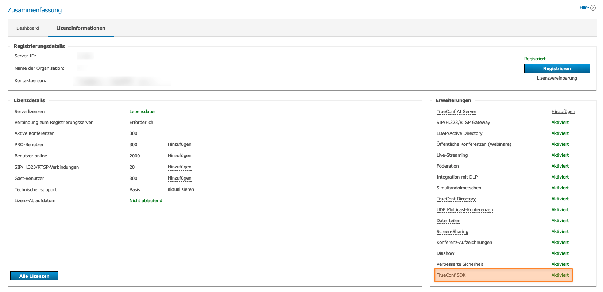
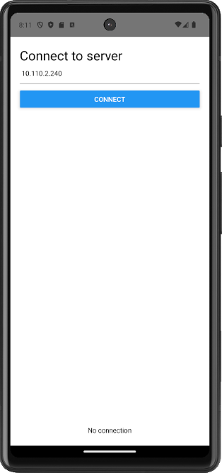
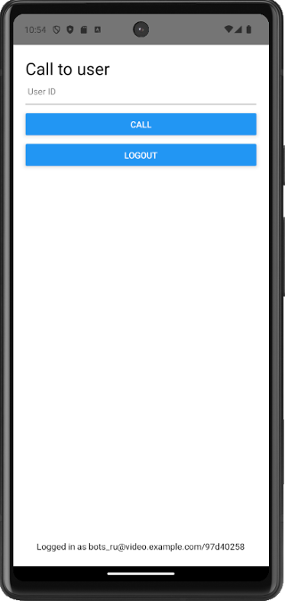
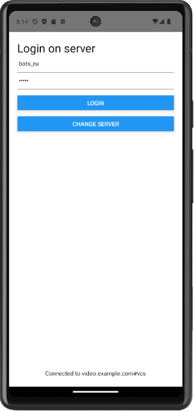
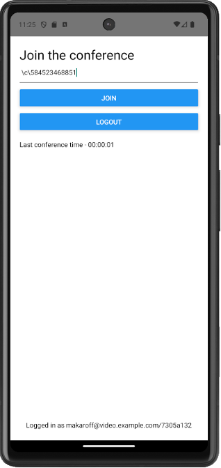
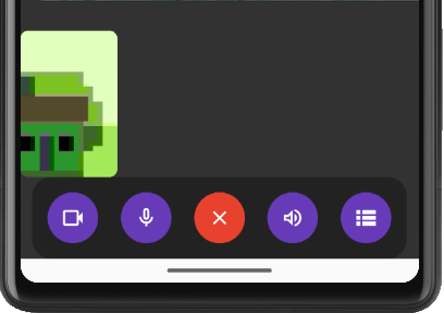
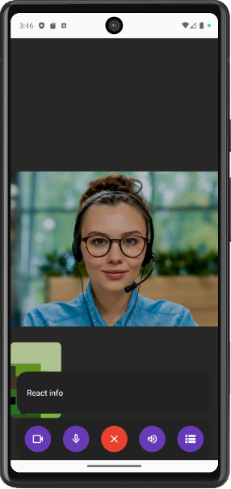
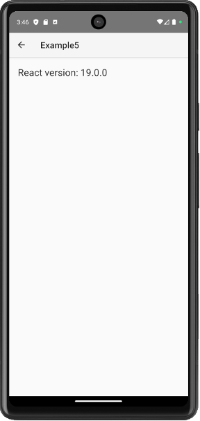
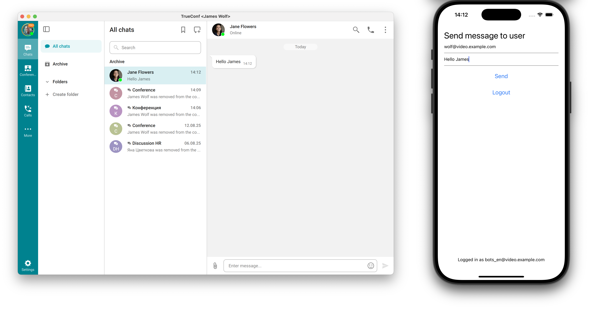
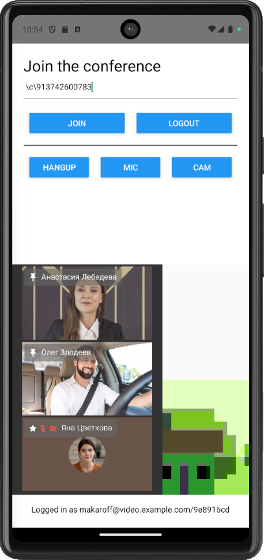

<p align="center">
  <a href="https://trueconf.com" target="_blank" rel="noopener noreferrer">
    <picture>
      <source media="(prefers-color-scheme: dark)" srcset="assets/logo.svg">
      
    </picture>
  </a>
</p>

<h1 align="center">TrueConf SDK für React Native</h1>

<p align="center">Eine Softwarebibliothek zur Integration von Videokonferenzen auf Unternehmensniveau in mobile Anwendungen mit React Native</p>

<p align="center">
    <a href="https://t.me/trueconf_chat" target="_blank">
        
    </a>
    <a href="https://discord.gg/2gJ4VUqATZ">
        
    </a>
    <a href="#">
        
    </a>
</p>

<p align="center">
  <a href="./README.md">English</a> /
  <a href="./README-ru.md">Русский</a> /
  <a href="./README-de.md">Deutsch</a> /
  <a href="./README-es.md">Español</a>
</p>

<p align="center">  </p>

## Was ist das TrueConf SDK für React Native?

**TrueConf SDK für React Native** ist ein plattformübergreifendes
Software-Framework zur Integration von Videokonferenzen auf Unternehmensebene in
mobile Anwendungen auf iOS und Android. Es ermöglicht Entwicklern, ihren
Projekten schnell Unterstützung für **Videoanrufe**,
**Gruppenvideokonferenzen**, Chats hinzuzufügen und die Benutzeroberfläche
flexibel an die Geschäftsanforderungen anzupassen.

TrueConf SDK wird dem Projekt als externe Abhängigkeit hinzugefügt und bietet dem
Entwickler eine umfangreiche API-Suite für die vollständige Integration mit dem
TrueConf-Videokonferenzsystem. Es umfasst:

* Benutzerauthorisierung;
* Anrufe tätigen und an Konferenzen teilnehmen;
* Erhalt und Verfolgung von Benutzerstatus;
* Arbeiten mit Multimedia;
* Anpassung von Schnittstellen und Video-Layouts.

### Anwendungsbereich

TrueConf SDK eignet sich zur Erstellung von:

* unternehmensinterne Messenger mit Videokonferenzfunktion;
* Lösungen für Telemedizin;
* mobilen Arbeitsplätzen;
* branchenspezifische Anwendungen für Sicherheit, Bildung, Industrie usw.

### Technische Merkmale

* Verbindung zum Server über das **trueconf**-Protokoll.
* Autorisierung und Registrierung im Benutzerkonto.
* Teilnahme an Gruppenkonferenzen.
* Anrufe an andere Benutzer.
* Chat innerhalb der Konferenz.
* Erhalten und Verfolgen von Benutzerstatus.
* Anpassung der Schnittstelle und Videokomponenten.

### Unterstützte Frameworks

TrueConf SDK ist nicht nur für native Plattformen verfügbar, sondern auch für
plattformübergreifende Entwicklung:

* .NET (C#)
* React Native (JavaScript)
* Cordova (JavaScript)
* Qt (C++)

### Integration mit dem TrueConf-Ökosystem

Das Vorhandensein eines offiziellen SDK garantiert eine zuverlässige Interaktion
mobiler Anwendungen mit anderen TrueConf-Produkten, einschließlich:

* Server TrueConf Server;
* andere clientseitige Anwendungen auf SDK-Basis;
* externe Systeme über die TrueConf Server API.

> [!TIP]
> Die Verbindung von mobilen Anwendungen, die mit dem TrueConf Mobile SDK erstellt wurden, ist nur zu Servern möglich, auf denen die [TrueConf SDK-Erweiterung aktiviert ist](https://trueconf.com/docs/server/en/admin/extensions/#support-for-sdk-applications).

<p align="center">
  
</p>

## Zugriff auf das TrueConf SDK erhalten

**TrueConf SDK** für mobile Anwendungen wird über ein **privates
Remote-Repository** bereitgestellt. Der Zugriff darauf wird **auf individuelle
Anfrage** gewährt – wenden Sie sich an den Vertrieb über das Kontaktformular auf
der Website oder über die [offiziellen
Kontakte](https://trueconf.com/company/contacts.html).

**Wie man Zugang erhält:**

1. **Kontaktieren Sie den Vertriebsabteilung von TrueConf.** Geben Sie an, dass
Sie Zugriff auf das TrueConf SDK und das private Maven-Repository für Android
wünschen. Kontakte: <https://trueconf.com/company/contacts.html>
1. **Beschreiben Sie Ihr Projekt**. Vertreter von TrueConf könnten sich nach den
Zielen für die Verwendung des SDK erkundigen.
1. **Holen Sie sich die Zugangsdaten.** Nach Prüfung Ihres Antrags erhalten Sie
einen Benutzernamen und ein Passwort für den Zugriff auf das Maven-Repository
sowie auf das geschlossene Repository mit dem TrueConf SDK.

> [!NOTE] Nachdem der Zugriff gewährt wurde, kopieren Sie den Ordner
`./React Native/TrueConf SDK` in das Stammverzeichnis dieses Beispielprojekts.

## Projektstruktur

Alle unten besprochenen Beispiele können aus diesem GitHub-Repository
heruntergeladen werden. Jedes ReactNative-Projektbeispiel hat ungefähr die
folgende Struktur:

<details>
  <summary>Projektstruktur</summary>

<pre>
ReactNative/
│
├── Example1/                    // Projekt Nr. 1 in React Native
│   ├── __tests__/               // Unit-Tests
│   ├── .bundle/                 // Cache von Metro Bundler
│   ├── .idea/                   // Konfiguration der JetBrains‑IDE
│   ├── .vscode/                 // Konfiguration von Visual Studio Code
│   │
│   ├── android/                 // Verzeichnis der Android‑App
│   │   ├── .gradle/
│   │   ├── .kotlin/
│   │   ├── app/                 // Java/Kotlin + Ressourcen + Manifest
│   │   ├── build/               // Build-Artefakte
│   │   ├── gradle/              // Gradle‑Wrapper
│   │   ├── build.gradle         // Build auf oberster Ebene
│   │   ├── gradle.properties    // Parameter
│   │   ├── gradlew              // Wrapper für Linux/macOS
│   │   ├── gradlew.bat          // Wrapper für Windows
│   │   └── settings.gradle      // Modulkonfiguration
│   │
│   ├── ios/                     // Verzeichnis der iOS‑App
│   │   ├── Example1/            // iOS‑Modul (AppDelegate, Info.plist usw.)
│   │   ├── Example1.xcodeproj/  // Xcode‑Projekt
│   │   ├── .xcode.env           // Umgebungsvariablen
│   │   └── Podfile              // CocoaPods‑Abhängigkeiten
│   │
│   ├── node_modules/            // Installierte npm/yarn‑Abhängigkeiten
│   ├── src/screens              // RN‑Komponenten
│   │   ├── Call.js
│   │   ├── Connect.js
│   │   └── Login.js
│   │
│   ├── .eslintrc.js             // ESLint‑Konfiguration
│   ├── .prettierrc.js           // Prettier‑Konfiguration
│   ├── .watchmanconfig          // Watchman
│   ├── App.js                   // Hauptkomponente der App
│   ├── index.js                 // Einstiegspunkt von RN
│   ├── app.json                 // App‑Konfiguration (Name, Icons usw.)
│   ├── babel.config.js          // Babel‑Konfiguration
│   ├── config.sh                // Setup-Skript (optional)
│   ├── Gemfile                  // Ruby‑Abhängigkeiten (z. B. CocoaPods)
│   ├── jest.config.js           // Jest‑Testkonfiguration
│   ├── metro.config.js          // Metro‑Bundler
│   ├── package.json             // Abhängigkeiten und npm/yarn‑Scripts
│   ├── README.md                // Projektdokumentation
│   ├── tsconfig.json            // TypeScript (falls verwendet)
│   └── yarn.lock                // Fixierung der Versionen
│
├── Example2/                    // Projekt Nr. 2
├── Example3/                    // Projekt Nr. 3
├── Example4/                    // ...
├── Example5/
├── Example6/
└── Example7/
</pre>
</details>

## Erste Schritte mit dem TrueConf SDK

Für dieses Framework ist das TrueConf SDK in einem npm-Paket verpackt, das mit
npm oder yarn zum Projekt hinzugefügt werden kann.

Erstellung und Einrichtung des Projekts:

Wenn Sie mit den Beispielen aus diesem GitHub-Repository arbeiten, genügt es, die
Punkte 3-5 auszuführen.

1. Richten Sie die Umgebung gemäß der offiziellen [React
Native](https://reactnative.dev/docs/set-up-your-environment) Anleitung ein.
1. Erstellen Sie ein Projekt, indem Sie den Befehl ausführen:

```sh
npx @react-native-community/cli@latest init PROJECT_NAME --skip-install
```

1. Navigieren Sie zum Projektordner (Beispiel1, Beispiel2 usw.) und installieren
Sie die erforderlichen npm-Pakete:

```sh
npm installieren
```

1. Installieren Sie das TrueConf SDK-Modul mit npm:

```sh
npm install PATH_TO_TRUECONF_MODULE --install-links=true
```

oder yarn:

```sh
yarn add PATH_TO_TRUECONF_MODULE
```

1. Notwendige CocoaPods für iOS installieren (nur für Mac-Computer):

```sh
cd ios && pod install
```

### Zusätzliche Schritte für Android

In **build.gradle** (`../Example*/android`) für alle Projekte das
Maven-Repository hinzufügen, in dem sich die Android SDK-Bibliotheken befinden.
`username` und `password` werden auf Anfrage über den <a
href="mailto:sales@trueconf.com">Manager</a> bereitgestellt.

```gradle
allprojects {
   repositories {
       maven {
           credentials {
               username 'username'
               password 'password'
           }
           url 'https://sdk.trueconf.com/maven/repository/maven-public/'
       }
   }
}
```

Vor der Initialisierung des SDK (vor dem Aufruf der Methode start) müssen die
folgenden Methoden aufgerufen werden:

* **registerApp** - hier muss **Application** (oder dessen Nachfolger, der im
Projekt verwendet wird) übergeben werden;
* **setFallbackActivity** - übergeben Sie die **Activity**-Klasse, zu der
zurückgekehrt werden soll, falls der Anruf beendet wird.

Dies kann zum Beispiel in der Klasse **MainApplication**
(`../Example*/android/app/src/main/java/com/example7/MainApplication.kt`) in
**onCreate** erfolgen:

```kotlin
override fun onCreate() {
    super.onCreate()
    SoLoader.init(this, OpenSourceMergedSoMapping)
    if (BuildConfig.IS_NEW_ARCHITECTURE_ENABLED) {
        // If you opted-in for the New Architecture, we load the native entry point for this app.
        load()
    }
    TrueConfSDK.getInstance().registerApp(this)
    TrueConfSDK.getInstance().fallbackActivity = MainActivity::class.java
}
```

### Zusätzliche Schritte für iOS

Fügen Sie die Berechtigungen zur Verwendung der Kamera und des Mikrofons direkt
im Xcode-Projekt in die **Info.plist**-Datei ein, oder führen Sie die folgenden
Befehle im Projektordner aus:

```sh
cd ios/PROJECT_NAME
plutil -insert NSCameraUsageDescription -string '' Info.plist
plutil -insert NSMicrophoneUsageDescription -string '' Info.plist
```

> [!TIP]
> Die minimal unterstützte Version für Android ist 7.0 (API 24), für iOS ist es 15.0.

## Funktionen des TrueConf SDK

Vollständige Informationen über das TrueConf SDK finden Sie in der [offiziellen
Dokumentation](https://trueconf.ru/docs/mobile-sdk/ru/overview/).

<details>
  <summary>Tabelle mit Funktionen</summary>
  <table>
  <thead>
    <tr>
      <th>Funktion</th>
      <th>Parameter</th>
      <th>Rückgabewert</th>
    </tr>
  </thead>
  <tbody>
    <tr><td>stop</td><td>—</td><td>Stoppt das SDK und gibt Ressourcen frei</td></tr>
    <tr><td>loginAs</td><td>user: string; pwd: string; encryptPassword: boolean; enableAutoLogin: boolean</td><td>boolean — true, wenn die Anmeldeanforderung gesendet wurde</td></tr>
    <tr><td>logout</td><td>—</td><td>boolean — true, wenn die Abmeldeanforderung gesendet wurde</td></tr>
    <tr><td>callTo</td><td>user: string</td><td>boolean — true, wenn der Anruf an den Server gesendet wurde</td></tr>
    <tr><td>joinConf</td><td>conf_ID: string</td><td>boolean — true, wenn der Beitritt zur Konferenz begonnen wurde</td></tr>
    <tr><td>hangup</td><td>forAll: boolean (Standard: true)</td><td>boolean — true, wenn der Anruf beendet werden kann</td></tr>
    <tr><td>acceptCall</td><td>accept: boolean</td><td>boolean — true, wenn die Antwort auf den Anruf gesendet wurde</td></tr>
    <tr><td>parseProtocolLink</td><td>cmd: string</td><td>Führt die in der Befehlszeichenkette angegebenen Aktionen aus</td></tr>
    <tr><td>scheduleLoginAs</td><td>login: string; pwd: string; encryptPassword: boolean; callToUser: string; autoClose: boolean; loginTemp: boolean; loginForce: boolean; domain: string; serversList: string; isPublic: boolean</td><td>Führt Anmeldung und Anruf nacheinander aus</td></tr>
    <tr><td>muteMicrophone</td><td>mute: boolean</td><td>Schaltet das Mikrofon ein oder aus</td></tr>
    <tr><td>muteCamera</td><td>mute: boolean</td><td>Schaltet die Kamera ein oder aus</td></tr>
    <tr><td>getMyId</td><td>—</td><td>string — Kennung des aktuellen Benutzers oder nil</td></tr>
    <tr><td>getMyName</td><td>—</td><td>string — Anzeigename des Benutzers oder nil</td></tr>
    <tr><td>isStarted</td><td>—</td><td>boolean — true, wenn das SDK gestartet ist</td></tr>
    <tr><td>isConnectedToServer</td><td>—</td><td>boolean — true, wenn eine Verbindung zum Server besteht</td></tr>
    <tr><td>isLoggedIn</td><td>—</td><td>boolean — true, wenn der Benutzer angemeldet ist</td></tr>
    <tr><td>isInConference</td><td>—</td><td>boolean — true, wenn der Client in einer Konferenz ist</td></tr>
    <tr><td>getUserStatus</td><td>user: string</td><td>UserPresStatus — Status eines anderen Benutzers</td></tr>
    <tr><td>isMicrophoneMuted</td><td>—</td><td>boolean — true, wenn das Mikrofon stummgeschaltet ist</td></tr>
    <tr><td>isCameraMuted</td><td>—</td><td>boolean — true, wenn die Kamera stummgeschaltet ist</td></tr>
    <tr><td>acceptRecord</td><td>accept: boolean; userID: string</td><td>Antwortet auf die Aufnahmeanfrage</td></tr>
    <tr><td>sendChatMessage</td><td>toID: string; text: string</td><td>boolean — true, wenn die Nachricht an den Server gesendet wurde</td></tr>
  </tbody>
</table>
</details>

Nachfolgend werden Beispiele von Anwendungen mit den oben beschriebenen
Funktionen des TrueConf SDK aufgeführt.

## Beispiel Nr. 1 - Demonstration der grundlegenden Funktionen des TrueConf SDK

Eine Anwendung, in der alle Hauptfunktionen des TrueConf SDK implementiert sind:

* Initialisierung des SDK und Verbindung zum Server;
* Authentifizierung und Abmeldung vom Benutzerkonto;
* einen Anruf an einen Server-Teilnehmer über seine [TrueConf
ID](https://trueconf.com/docs/server/en/admin/users/#user-id);
* Möglichkeit, eingehende Audio- und Videoanrufe anzunehmen.

<p align="center">
  
  
  
</p>

Öffnen Sie im Projekt **Example1** den Ordner **src/screens**, der für die
Benutzeroberfläche der Anwendung verantwortlich ist und die Bildschirme
`Connect.js` (Verbindung zum Server), `Login.js` (Serveranmeldung) und `Call.js`
(Benutzeranruf) enthält. Lassen Sie uns die Benutzeroberfläche der Anwendung am
Beispiel des Bildschirms `Connect.js` analysieren.

### Bildschirme der Anwendung

Im `Connect.js`-Datei wird der Zustand der Variablen festgelegt. Wenn im
`serverName` die Adresse von TrueConf Server angegeben wird, erfolgt die
Verbindung automatisch. Dieses Verhalten gilt für alle Projektdemonstrationen
von Example.

```js
state = {
    serverName: "",
    serverError: null
}
```

Die Schaltfläche `Connect` ruft die Methode `onPressConnect` auf, die die
Eingabedaten überprüft. Ist das Feld `serverName` leer, wird dem Benutzer ein
Fehler angezeigt. Sind die Daten gültig, wird die Steuerung an die
Callback-Funktion `onConnect` übergeben.

```js
onPressConnect = () => {
    if (this.state.serverName.trim() === "") {
        this.setState({ serverError: "Server is required" });
    } else {
        this.props.onConnect(this.state.serverName);
    }
}
```

Als nächstes betrachten wir die visuelle Gestaltung des `Connect.js`-Bildschirms,
der folgende Komponenten enthält: Überschrift, Eingabefeld, Fehlermeldung und
Verbindungsschaltfläche.

**Beispielcode:**

```js
render() {
    return (
        <View style={{padding: 20}}>
            <Text
                style={{fontSize: 27, color: "black"}}>
                Verbindung zum Server
            </Text>
            <TextInput
                style={{height: 40, borderBottomColor: 'gray', borderBottomWidth: 1, color: "black"}}
                placeholder='Servername oder IP'
                placeholderTextColor='gray'
                onChangeText={(serverName) => this.setState({serverName})}
                value={this.state.serverName} />
            {!!this.state.serverError &&
            (
                <Text
                    style={{ color: "red" }}>
                    {this.state.serverError}
                </Text>
            )}
            <View style={{margin:7}} />
            <Button
                onPress={this.onPressConnect}
                title="Verbinden" />
        </View>
    )
}
```

Nun gehen wir zur Hauptklasse der Anwendung `App.js` über. Lassen Sie uns die
wichtigsten Codeabschnitte betrachten.

Import des TrueConf SDK-Moduls und der Anwendungsbildschirme:

```js
import TrueConfSDK from 'react-native-trueconf-sdk';
import Call from './src/screens/Call';
import Login from './src/screens/Login';
import Connect from './src/screens/Connect';
```

Im Objekt `state` werden zwei wichtige Flags gespeichert:

* `connected` – ist für die Verbindung zum Server verantwortlich;
* `loggedIn` – zeigt an, ob der Benutzer angemeldet ist.

Um die Bildschirme `Connect.js` und `Login.js` anzuzeigen, müssen die
entsprechenden Schlüssel `connected` und `loggedIn` im Objekt `state` den Wert
`false` haben.

```js
state = {
    loggedIn: false,
    connected: false,
    serverName: "",
    status: STATUS.separado
  }
```

Dies ermöglicht eine schrittweise Steuerung der Schnittstelle abhängig vom
aktuellen Verbindungsstatus und der Benutzeranmeldung.

### Ereignisverarbeitung vom TrueConf SDK

In dieser Klasse wird der Servername gespeichert (wird auf dem Bildschirm
**`Login.js`** angezeigt) und der Verbindungsstatus (`Verbunden mit` oder
`Keine Verbindung`) bei jeder Änderung des Verbindungsstatus aktualisiert.

```js
onServerStatus = (event) => {  
    this.state.serverName = event.serverName;  
    this.setState({ connected: event.connected });  
    this.setState({ status: event.connected? STATUSES.connected + event.serverName : STATUSES.disconnected });  
  }
```

Der Schlüssel `LoggedIn` des Statusobjekts `onLogin` wird vom SDK aufgerufen,
wenn sich der Autorisierungsstatus des Benutzers ändert. Er aktualisiert den
Zustand der Komponente, um die Benutzeroberfläche neu zu rendern:

* `loggedIn` – wird auf den vom SDK erhaltenen Wert gesetzt (`event.loggedIn`);
* `status` – dynamisch berechneter String zur Anzeige im unteren Bereich der
Benutzeroberfläche. Zeigt den aktuellen Status der Anwendung an
(`Angemeldet als <userID>` oder `Verbunden mit <serverName>`).

```js
onLogin = (event) => {    
    this.setState({ loggedIn: event.loggedIn });
    this.setState({ status: event.loggedIn? STATUSES.loggedIn + event.userID : STATUSES.connected + this.state.serverName });
}
```

Beim Ausloggen nimmt der Schlüssel **`LoggedIn`** den Wert **`false`** an, und
der Status **Connected to** wird angezeigt.

```js
onLogout = () => {
    this.setState({ loggedIn: false });
    this.setState({ status: STATUSES.connected + this.state.serverName });
  }
```

Damit die Anwendung mit mehreren Bildschirmen (`src/screens`) zwischen ihnen
wechseln kann, muss ein Algorithmus festgelegt werden. Die Logik zum Wechseln
der Bildschirme der Anwendung ist wie folgt:

1. Wenn die Authentifizierung erfolgreich ist, wechseln Sie zum Bildschirm
**Call**. 2. Wenn die Verbindung zum Server erfolgreich ist, wechseln Sie zum
Fenster **Login**. Andernfalls Rückkehr zu **Connect**.

```js
screenForState() {
    if(this.state.loggedIn) {
      return <Call
        onCall={callID => TrueConfSDK.callTo(callID)}
        onLogout={() => TrueConfSDK.logout()}/>
    } else {
      if(this.state.connected) {
        return <Login
          onLogin={(login, password) => TrueConfSDK.loginAs(login, password, true, false)}
          onDisconnect={() => this.setState({ connected: false })}/>
      } else {
        return <Connect
          onConnect={server => {
            TrueConfSDK.start(server);
            this.initEventsListeners();
            console.log('Start TrueConf SDK');
          }
        } />
      }
    }
  }
```

Für die Bildschirme `Connect.js`, `Login.js` und `Call.js` müssen einheitliche
Anzeigegrenzen für die Benutzeroberfläche der Anwendung festgelegt werden. Diese
Parameter gelten für alle Bildschirme:

* `SafeAreaView` — ein oberster Container, der den Anzeigebereich innerhalb der
sicheren Zone des Geräts einschränkt.
* Der Hauptinhalt (`this.screenForState()`) nimmt 95% der Bildschirmhöhe ein.
* Die Statusleiste (`status` aus `state`) ist unten fixiert und nimmt 5% der Höhe
ein. Sie wird horizontal mit `alignItems: 'center'` zentriert.

```js
render() {
  return (
    <SafeAreaView style={{flex: 1, backgroundColor: 'white'}}>
      <StatusBar barStyle={'dark-content'} />
      <View style={{flex: 0.95}}>
        { this.screenForState() }
      </View>
      <View style={{flex: 0.05, alignItems: 'center'}}>
          <Text>{this.state.status}</Text>
      </View>
    </SafeAreaView>
  )
}
```

In dem Objekt `STATUSES` werden Statuskonstanten definiert, die im unteren Teil
der Benutzeroberfläche angezeigt werden. Jedem Schlüssel (`disconnected`,
`connected`, `loggedIn`) entspricht eine Beschriftung, die dem Benutzer
angezeigt wird. Sie können Ihre eigenen Schlüssel und Textwerte entsprechend den
Anforderungen der Anwendung verwenden.

```js
const STATUSES = {
  disconnected: 'Keine Verbindung',
  connected: 'Verbunden mit ',
  loggedIn: 'Angemeldet als ',
};
```

### Arbeiten mit iOS-Geräten

In iOS muss zur Anzeige der systemeigenen Benutzeroberfläche
[CallKit](https://developer.apple.com/documentation/callkit/) verwendet werden.
In diesem Beispiel werden wir das nicht tun und stattdessen eine einfachere
Methode verwenden – die Nutzung von `Alert.alert()`.

```js
onInvite = (event) => { if (Platform.OS === 'ios'){ Alert.alert( 'Eingehender Anruf', 'Eingehenden Anruf von ' + event.userID annehmen', [{ text: 'Ablehnen', onPress: () => TrueConfSDK.acceptCall(false), style: 'cancel', }, {text: 'Annehmen', onPress: () => TrueConfSDK.acceptCall(true)}, ], ); } }
```

Zur Integration von React Native mit `CallKit` können Sie die folgenden
Bibliotheken verwenden:

* react-native-callkeep
* react-native-voip-call

## Beispiel Nr. 2 - Demonstration der Arbeit mit TrueConf-Links

Betrachten wir ein Beispiel, in dem die Anwendung die Verbindung zu TrueConf
Server ermöglicht und einen Anruf über das URI-Schema **trueconf** initiiert
(zum Beispiel `trueconf:ivanov`). Dies kann entweder ein Anruf an einen
bestimmten Benutzer über seine TrueConf ID oder eine Verbindung zu einer
Gruppen-Konferenz über deren ID sein. Die Autorisierung und Verbindung erfolgen
automatisch – Login und Serverparameter werden innerhalb des Links übermittelt.
Der Anruf wird mit der Methode **`parseProtocolLink`** verarbeitet, welcher der
Aufrufstring im **String**-Format übergeben wird.

Auf dem Bildschirm `Parse.js` zeigt die Komponente `TextInput` ein Eingabefeld
für einen Link im Format `trueconf:` an. Der vom Benutzer eingegebene Text wird
im Zustand der Komponente unter dem Schlüssel `plink` gespeichert.

```js
<TextInput
      style={{height: 40, borderBottomColor: 'gray', borderBottomWidth: 1, color: "black"}}
      placeholder='Protokoll-Link'
      placeholderTextColor='gray'
      onChangeText={(plink) => this.setState({plink})}
      value={this.state.plink}
/>
```

Die Komponente `<Parse/>` wird mit dem Prop `onParse` gerendert, welches
aufgerufen wird, wenn die Eingabe durch den Benutzer bestätigt wird (Bildschirm
`Parse.js`). In diesem Fall wird beim Auslösen von `onParse` der übergebene
String `plink` an die Methode `TrueConfSDK.parseProtocolLink()` zur Verarbeitung
übergeben.

```js
<Parse
      onParse={plink => TrueConfSDK.parseProtocolLink(plink)}
/>
```

Um sich über einen trueconf-Link mit einer Konferenz zu verbinden, sind folgende
Parameter erforderlich:

* `[confID]` – Konferenz-ID;
* `[serverID]` – Server-ID;
* `[login]` – der Benutzername (TrueConf ID), mit dem Sie sich auf dem
angegebenen Server anmelden müssen;
* `[password]` – das Passwort des Benutzers, mit dem auf dem angegebenen Server
authentifiziert werden muss.

```
trueconf:[confID]@[serverID]%23vcs&h=serverID&login=[login]&password=[password]&encrypt=1&force=1
```

Zum Beispiel, um sich als Benutzer auf dem Server **truevideo.example.com** zu
authentifizieren und einem Anruf in die Konferenz auf dem Server
**video.example.com** beizutreten, muss Folgendes eingegeben werden:

```
trueconf:\c\737734033583@video.example.com%23vcs&h=truevideo.example.com&login=user&password=pswd&encrypt=1&force=1
```

## Beispiel Nr. 3 - Arbeiten mit Benutzerstatussen

Das Beispiel zeigt, wie man den Status von Benutzern auf dem Server überwacht und
wie man einen Benutzer hinzufügt, um seine Verfügbarkeit zu überwachen.

Auf dem Bildschirm `AddUser.js` ermöglicht die Komponente `TextInput` die Eingabe
der TrueConf-ID des Benutzers, dessen Status verfolgt werden soll. Der
eingegebene Wert wird im Zustand der Komponente zur späteren Verarbeitung
gespeichert.

```js
<TextInput
      style={{height: 40, borderBottomColor: 'gray', borderBottomWidth: 1, color: "black"}}
      placeholder='Benutzer-ID'
      placeholderTextColor='gray'
      onChangeText={(userID) => this.setState({userID})}
      value={this.state.userID}
/>
```

Im Hauptbestandteil `App.js`, wird bei der Hinzufügung eines neuen Benutzers
(über die Komponente `AddUser`) dessen ID an die Methode
`TrueConfSDK.getUserStatus()` übergeben, die eine Statusabfrage an den Server
initiiert.

```js
<View style={{flex: 1}}>
    <AddUser onAdd={userID => TrueConfSDK.getUserStatus(userID)}/>
    <UsersList users={this.state.users}/>
</View>
```

Beim Empfang des Status wird `onUserStatusUpdate` aufgerufen und der Benutzer
wird in der Liste `state.users` aktualisiert oder hinzugefügt.

```js
onUserStatusUpdate = (event) => {
    let exist = false;
    let list = this.state.users;
    for(let i = 0; i < list.length; i++) {
      if(list[i].userID === event.userID) {
        list[i].state = event.state;
        exist = true;
        break;
      }
    }
    if(!exist) {
      list.push({ userID: event.userID, state: event.state});
    }
    this.setState({ users: list });
  }
```

### Benutzerstatus

Auf dem Bildschirm `UserList.js` wandelt die Methode `getStatusString` die
numerischen Statuscodes der Benutzer, die vom SDK zurückgegeben werden, in
Textwerte um, die in der Benutzeroberfläche angezeigt werden.

```js
getStatusString = (state) => {
  switch(state) {
    case -127:
      return "Undefined";
    case -1:
      return "Unknown";
    case 0:
      return "Offline";
    case 1:
      return "Online";
    case 2:
    case 3:
    case 4:
    case 5:
      return "Busy";
  }
}
```

Die Methode `getStatusColor` stimmt die Statusfarben in der Benutzeroberfläche
mit dem vom SDK erhaltenen Zahlencode ab.

```js
getStatusColor = (state) => {
    switch(state) {
      case -127:
      case -1:
        return "grau";
      case 0:
        return "rot";
      case 1:
        return "grün";
      case 2:
      case 3:
      case 4:
      case 5:
        return "orange";
    }
  }
```

## Beispiel Nr. 4 - Arbeit mit Gruppenkonferenzen

Dieses Beispiel zeigt die Verbindung zu einer Mehrbenutzer-Videokonferenz mittels
der Methode **joinConf(conferenceId)**. Im Gegensatz zum Aufruf eines bestimmten
Benutzers durch **callTo(userId) verwendet in** [Beispiel Nr.
1](), wird hier die
Konferenz-ID **(String confId)** verwendet, um sich mit einer bereits auf dem
Server erstellten Sitzung zu verbinden.

Die Benutzeroberfläche unterscheidet sich praktisch nicht von [Beispiel Nr.
1](), außer dass die
Methode `joinConf(...)` anstelle von `callTo(...)` verwendet wird.

<p align="center">
  
  
  
</p>

> [!Note]
> Derzeit wird nur die Verbindung zu bereits bestehenden Konferenzen unterstützt.

Auf dem Bildschirm `Join.js` führt die Methode `onPressJoin` eine Validierung
durch und überprüft, ob das Eingabefeld nicht leer ist; wenn es leer ist, wird
`ConfIDError` angezeigt. Wenn die Daten gültig sind, wird `onJoin` aufgerufen,
das vom übergeordneten Komponenten übergeben wurde, und der Verbindungsprozess
wird initiiert:

```js
onPressJoin = () => {
        if (this.state.confID.trim() === "") {
            this.setState({ confIDError: "Konferenz-ID ist erforderlich" });
          } else {
            this.props.onJoin(this.state.confID);
          }
    }
```

Im Hauptbestandteil `App.js` wird im Verfahren `screenForState` die `confTime` an
die Komponente `Join` als Zustandsvariable `this.state.confTimeStr` übergeben,
die Informationen über die Konferenzdauer enthält.

```js
screenForState() {
    if(this.state.loggedIn) {
      return <Join
        onJoin={confID => TrueConfSDK.joinConf(confID)}
        onLogout={() => TrueConfSDK.logout()}
        confTime={this.state.confTimeStr}
        />
```

Wenn die `Conference ID` korrekt angegeben ist, wird die Verbindung zur
entsprechenden Konferenz hergestellt:

<p align="center">
  
</p>

## Beispiel Nr. 5 - Anpassung der Benutzeroberfläche

Im TrueConf SDK für React Native können Sie das Anrufsteuerungsfeld erweitern,
indem Sie eigene Schaltflächen über die Schnittstelle `addExtraButton()`
hinzufügen. Dies ermöglicht das Ausführen zusätzlicher Aktionen direkt aus dem
Konferenzfenster. In unserem Beispiel ist dies das Öffnen eines modalen Fensters
mit der React Native-Version.

<p align="center">
  
</p>

### Wie funktioniert das?

Benutzerdefinierte Schaltflächen werden mit der Methode
`TrueConfSDK.addExtraButton()` hinzugefügt. Diese Schaltflächen erscheinen in
der Konferenzoberfläche, wenn Sie auf die Schaltfläche "Ellipsis" (⋯) klicken —
das ist das rechte Element der Steuerleiste während des Anrufs. Außerdem können
Sie die Standard-Icons (zum Beispiel Mikrofon, Kamera, Lautsprecher,
Anrufbeendigungstaste usw.) ersetzen, indem Sie die Bildressourcen im Ordner
austauschen:

* für Android (Format .xml) – **/android/app/src/main/res/drawable**;
* für iOS (Format .svg) – **/ios/Example5/Images.xcassets**.

> [!Warning]
> Dateinamen müssen exakt den erwarteten SDK-Identifikatoren entsprechen.

Verfügbare zu ändernde Namen von Schnittstellenelementen:

| Identifikator | Beschreibung |
| --- | --- |
| `call_end` | Anruf beenden |
| `camera_on_new` / `camera_off_new` | Kamera im Ein-/Aus-Zustand |
| `mic_on_new` / `mic_off_new` | Mikrofon ein/aus |
| `Ton_aus_neu` | Audiowiedergabegerät im ausgeschalteten Zustand |
| `sound_on_new` | aktuelles Ausgabegerät — Lautsprecher |
| `Empfängerklang` | aktuelles Ausgabegerät — Freisprecheinrichtung |
| `airpods_gerät` | Aktuelles Audioausgabegerät — kabellose Kopfhörer AirPods. |
| `airpodspro_gerät` | aktuelles Audioausgabegerät — kabellose Kopfhörer AirPods Pro |
| `bluetooth_gerät` | aktuelles Audioausgabegerät — Bluetooth-Gerät |
| `wired_device` | aktuelles Ausgabegerät — kabelgebundene Kopfhörer |
| `mehr_neu` | die Schaltfläche „Auslassungspunkte“, die eine Liste zusätzlicher Schaltflächen öffnet |
| `camera_swap` | Umschalten der Kamera von der Front- auf die Rückseite und umgekehrt |
| `mehr_btn` | Auswahl der Kamera und Ein-/Ausschalten der Taschenlampe |

Im Hauptbestandteil `App.js` fügt die Methode `addExtraButton()` eine
benutzerdefinierte Schaltfläche zur Benutzeroberfläche des Videogesprächs hinzu.
Die Schaltfläche erscheint nach erfolgreicher Verbindung mit dem Server.

```js
return <Connect
  onConnect={server => {
    TrueConfSDK.start(server);
    this.initEventsListeners();
    TrueConfSDK.addExtraButton("React info");
    console.log('Start TrueConf SDK');
  }}
/>
```

Die Methode `addEventListener` verknüpft den Handler `onClickListener` mit dem
Ereignis `onExtraButtonPressed`.

```js
TrueConfSDK.addEventListener('onExtraButtonPressed', this.onClickListener);
```

Die Methode `onClickListener` ruft das native API-SDK `showAlertPage` auf, um ein
modal Vollbild-Fenster mit Informationen zur React Native-Version anzuzeigen.

```js
onClickListener = () => {
    TrueConfSDK.showAlertPage("React-Version: " + React.version);
  }
```

<p align="center">
  
  
</p>

## Beispiel Nr. 6 - Chat

Dieses Beispiel zeigt die Implementierung eines Textchats, einschließlich des
Sendens von Nachrichten mit `sendChatMessage()` und der Verarbeitung eingehender
Ereignisse über `onChatMessageReceived()`.

In diesem Material werden wir untersuchen, wie der Chat in der mobilen App unter
Verwendung des TrueConf SDK aufgebaut ist, und zeigen, wie das Senden, Anzeigen
und Verarbeiten von Nachrichten aus der Sicht der App-Architektur erfolgt.

### Empfang von Nachrichten

Bei einer eingehenden Nachricht löst die Komponente `App.js` ein Ereignis aus, um
eine Bildschirmanzeige zu zeigen. Die Benachrichtigung zeigt die Beschriftung
(`New message`), die vollständige TrueConf ID des Absenders (`fromUserID`) und
den Inhalt der Nachricht (`message`) an.

```js
onChatMessageReceived = (event) => {
   Alert.alert("Neue Nachricht", event.fromUserID + ": " + event.message, [{text: 'OK', style: 'cancel'}]);
 }
```

### Senden von Nachrichten

Auf dem Bildschirm `Chats.js` speichert die Methode `onPressSend` den in die
Eingabefelder `message` und `userID` eingegebenen Text (es wird die vollständige
TrueConf-ID verarbeitet, z. B.: `petrov@vcs.trueconf.com`) und initiiert das
Senden einer Textnachricht über das TrueConf SDK.

```js
onPressSend = () => {
    if (this.state.message.trim() === "") {            
        this.setState({ messageError: this.state.message.trim() === "" ? "Nachricht ist erforderlich" : null });
    } else {
        this.props.onSend(this.state.userID, this.state.message);
    }
}
```

Die Komponente `Chat` erhält die Funktion `onSend`, die die Methode
`sendChatMessage` mit der angegebenen `userID` und dem Nachrichtentext aufruft.

```js
if(this.state.loggedIn) {
      return <Chat
        onSend={(userID, message) => TrueConfSDK.sendChatMessage(userID, message)}
        onLogout={() => TrueConfSDK.logout()}/>
```

Wenn die vollständige `userID` korrekt angegeben ist, wird die Nachricht dem
Benutzer zugestellt.

<p align="center">
  
</p>

## Beispiel Nr. 7 – Anpassung der Video-Layout in der Konferenz

Im Beispiel wird die Möglichkeit gezeigt, die Selbstansicht und das Layout mit
den Konferenzteilnehmern in separaten Fenstern anzuzeigen. Es ist möglich,
eigene Konferenzsteuerungsschaltflächen zu implementieren, die Ausrüstung vor
Beginn der Konferenz einzurichten und die Fenster für ausgehende und eingehende
Anrufe durch benutzerdefinierte zu ersetzen.

<p align="center">
  
</p>

Auf dem Bildschirm `Join.js` wurden die Steuerungstasten **Hangup**, **Mic**,
**Cam** hinzugefügt, die den SDK-Methoden entsprechen:

* `TrueConfSDK.hangup`;
* `TrueConfSDK.muteMicrophone`;
* `TrueConfSDK.muteCamera`.

```js
<View style={{flexDirection: 'row'}}>
    <View style={{flex:1, padding: 10}}>
        <Button
            title="Hangup"
            onPress={this.props.onHangup} />
    </View>
    <View style={{flex:1, padding: 10}}>
        <Button
            title="Mic"
            onPress={this.props.onMic} />
    </View>
    <View style={{flex:1, padding: 10}}>
        <Button
            title="Cam"
            onPress={this.props.onCam} />
    </View>
</View>
```

Die Methode `initCustomViews()` aktiviert den Modus für benutzerdefiniertes
Rendering von Videoansichten und ermöglicht es, die Standardoberfläche der
Konferenz durch eine benutzerdefinierte Implementierung zu ersetzen.

```js
componentDidMount() {
    TrueConfSDK.initCustomViews();
}
```

### Anpassung des Video-Layouts für Android

Um die Vorlage des Video-Layouts zu bearbeiten, öffnen Sie
`fragment_conference_cast.xml`. Der vollständige Pfad lautet
`../node_modules/react-native-trueconf-sdk/android/src/main/res/layout/fragment_conference_cast.xml`.

> [!TIP]
>
> - **LinearLayout** ist für das Aussehen Ihres Videos verantwortlich.
> - **RelativeLayout** ist für das Video der Teilnehmer verantwortlich.

```xml
<RelativeLayout
        android:id="@+id/gfxFragmentCast"
        android:layout_width="0dp"
        android:layout_height="match_parent"
        android:background="@color/Green"
        app:layout_constraintBottom_toBottomOf="parent"
        app:layout_constraintEnd_toStartOf="@id/insert_point"
        app:layout_constraintStart_toStartOf="parent" />


    <LinearLayout
        android:id="@+id/insert_point"
        android:layout_width="150dp"
        android:layout_height="200dp"
        android:background="@color/Orange"
        android:orientation="horizontal"
        app:layout_constraintBottom_toBottomOf="parent"
        app:layout_constraintEnd_toEndOf="parent" />
```

Um das `SelfView`-Fenster hinzuzufügen:

1. Im Layout eines benutzerdefinierten Fragments fügen Sie `layout` hinzu (zum
Beispiel `LinearLayout`, `RelativeLayout` oder jede andere `ViewGroup`).
1. Im Code die Methode `addGFXSelfViewSurface` aufrufen und dabei als Parameter
die `ViewGroup` übergeben, in der `SelfView` angezeigt werden soll.

Um das `SelfView`-Fenster zu entfernen, muss die Methode
`removeGFXSelfViewSurface` aufgerufen werden, die als Parameter `ViewGroup`
entgegennimmt, genau das `layout`, in dem sich `selfview` befand.

```js
@Override
public void onViewCreated(@NonNull View view, @Nullable Bundle savedInstanceState) {
    super.onViewCreated(view, savedInstanceState);

    RelativeLayout gfxFragmentCast = view.findViewById(R.id.gfxFragmentCast);
    ViewGroup insertPoint = view.findViewById(R.id.insert_point);

    addGFXFragment(gfxFragmentCast);
    addGFXSelfViewSurface(insertPoint);
}
```

#### Mikrofoneinstellungen

Um den Standardzustand des Mikrofons während eines Anrufs festzulegen, muss
`TrueConfSDK.getAudioDeviceController()` aufgerufen werden. Um das Mikrofon
standardmäßig stummzuschalten, rufen Sie Folgendes auf:

```js
public void muteMicrophone(boolean stummschalten) {
    TrueConfSDK.getAudioDeviceController().muteMicrophone(stummschalten);
}
```

#### Kameraeinstellungen

Um den Standardstatus der Kamera während eines Anrufs festzulegen, müssen Sie
`TrueConfSDK.getVideoDeviceController()` aufrufen. Um die Kamera standardmäßig
auszuschalten, rufen Sie Folgendes auf:

```js
public void muteCamera(boolean stumm) {
    TrueConfSDK.getVideoDeviceController().muteCamera(stumm);
}
```

#### Ändern der Größe und Koordinaten des Videos

Um ein benutzerdefiniertes Layout anzuzeigen, müssen Sie in
`RNTrueConfSdkModule.java` eine Variable vom Typ `WindowManager.LayoutParams`
erstellen, alle erforderlichen Parameter festlegen und die Methode
`setCallLayoutParams` aufrufen.

```js
@ReactMethod
    public void initCustomViews() {
        final float scale = context.getResources().getDisplayMetrics().density;
        int height = (int) (400 * scale + 0.5f);
        WindowManager.LayoutParams params = new WindowManager.LayoutParams();
        params.width = WindowManager.LayoutParams.MATCH_PARENT;
        params.height = height;
        params.gravity = Gravity.BOTTOM;
        params.y = 150;
        TrueConfSDK.getCallWindowController().setCallLayoutParams(params);
        TrueConfSDK.getCallScreenController().setConferenceFragment(new ConferenceFragmentCast(R.layout.fragment_conference_cast));
    }
```

### Anpassen des Video-Layouts für iOS

Um die Vorlage für das Video-Layout zu bearbeiten, öffnen Sie `RNTrueConfSdk.m`.
Der vollständige Pfad ist
`../node_modules/react-native-trueconf-sdk/ios/RNTrueConfSdk.m`.

* Der Container `self.xsview` ist für das Aussehen Ihres Videos verantwortlich.
* Der Container `self.xview` ist für das Video der Teilnehmer verantwortlich.

```objc
RCT_EXPORT_METHOD(initCustomViews)
{
   UIView* rootView = [UIApplication sharedApplication].delegate.window.rootViewController.view;


   self.xsview = [[UIView alloc] init];
   [rootView addSubview:self.xsview];
   self.xsview.translatesAutoresizingMaskIntoConstraints = NO;
   self.xsview.backgroundColor = [UIColor clearColor];
   [self.xsview.bottomAnchor constraintEqualToAnchor:rootView.safeAreaLayoutGuide.bottomAnchor constant: -48].active = YES;
   [self.xsview.trailingAnchor constraintEqualToAnchor:rootView.trailingAnchor constant: 0].active = YES;
   [self.xsview.heightAnchor constraintEqualToConstant: 200].active = YES;
   [self.xsview.widthAnchor constraintEqualToConstant: 150].active = YES;
  
   self.xview = [[UIView alloc] init];
   [rootView addSubview:self.xview];
   self.xview.translatesAutoresizingMaskIntoConstraints = NO;
   self.xview.backgroundColor = [UIColor clearColor];
   [self.xview.bottomAnchor constraintEqualToAnchor:rootView.safeAreaLayoutGuide.bottomAnchor constant: -48].active = YES;
   [self.xview.leadingAnchor constraintEqualToAnchor:rootView.leadingAnchor constant: 0].active = YES;
   [self.xview.trailingAnchor constraintEqualToAnchor:self.xsview.leadingAnchor constant: 0].active = YES;
   [self.xview.heightAnchor constraintEqualToAnchor:rootView.heightAnchor multiplier: 0.5].active = YES;


   self.tcsdk.windowsDelegate = self;


   self.tcsdk.xview = self.xview;
   self.tcsdk.xsview = self.xsview;
}
```
