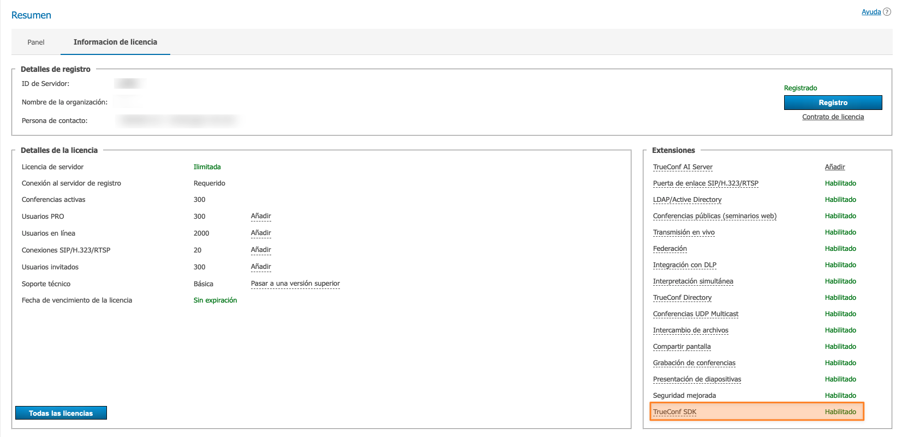

<p align="center">
  <a href="https://trueconf.com" target="_blank" rel="noopener noreferrer">
    <picture>
      <source media="(prefers-color-scheme: dark)" srcset="assets/logo.svg">
      
    </picture>
  </a>
</p>

<h1 align="center">TrueConf SDK para React Native</h1>

<p align="center">Biblioteca de software para integrar videoconferencia de nivel corporativo en aplicaciones móviles con React Native</p>

<p align="center">
    <a href="https://t.me/trueconf_chat" target="_blank">
        
    </a>
    <a href="https://discord.gg/2gJ4VUqATZ">
        
    </a>
    <a href="#">
        
    </a>
</p>

<p align="center">
  <a href="./README.md">English</a> /
  <a href="./README-ru.md">Русский</a> /
  <a href="./README-de.md">Deutsch</a> /
  <a href="./README-es.md">Español</a>
</p>

<p align="center">
  
</p>

## ¿Qué es TrueConf SDK para React Native?

**TrueConf SDK para React Native** es un marco de software multiplataforma para
integrar videoconferencias de nivel corporativo en aplicaciones móviles en iOS y
Android. Permite a los desarrolladores añadir rápidamente a sus proyectos
soporte para **videollamadas**, **videoconferencias grupales**, chats y
personalizar de manera flexible la interfaz según las necesidades del negocio.

TrueConf SDK se conecta al proyecto como una dependencia externa y proporciona al
desarrollador un amplio conjunto de API para una integración completa con el
sistema de videoconferencias TrueConf. Incluye:

* autorización de usuarios;
* realizar llamadas y participar en conferencias;
* recepción y seguimiento de estados de los usuarios;
* trabajo con multimedia;
* la personalización de interfaces y el diseño del vídeo.

### Ámbito de aplicación

TrueConf SDK es adecuado para crear:

* mensajeros corporativos con videollamadas;
* soluciones para telemedicina;
* puestos de trabajo móviles;
* aplicaciones industriales para la seguridad, la educación, la industria, etc.

### Características técnicas

* Conexión al servidor mediante el protocolo **trueconf**.
* Autorización y registro en la cuenta de usuario.
* Conexión a conferencias grupales.
* Llamadas a otros usuarios.
* Chat dentro de la conferencia.
* Obtener y rastrear los estados de los usuarios.
* Personalización de la interfaz y de los componentes de vídeo.

### Frameworks compatibles

TrueConf SDK está disponible no solo para plataformas nativas, sino también para
el desarrollo multiplataforma:

* .NET (C#)
* React Native (JavaScript)
* Cordova (JavaScript)
* Qt (C++)

### Integración con el ecosistema TrueConf

La disponibilidad de un SDK oficial garantiza una interacción confiable de las
aplicaciones móviles con otros productos TrueConf, incluyendo:

* servidor TrueConf Server;
* otros aplicaciones cliente basadas en SDK;
* sistemas externos a través de la API de TrueConf Server.

> [!TIP]
> La conexión de aplicaciones móviles creadas con TrueConf Mobile SDK solo es posible a servidores donde [la extensión TrueConf SDK está activada](https://trueconf.com/docs/server/es/admin/extensions/#support-for-sdk-applications).

<p align="center">
  
</p>

## Acceso a TrueConf SDK

**TrueConf SDK** para aplicaciones móviles se distribuye a través de un
**repositorio remoto cerrado**. El acceso se proporciona **bajo solicitud
individual** — comuníquese con el departamento de ventas a través del formulario
de contacto en el sitio web o mediante [los contactos
oficiales](https://trueconf.com/company/contacts.html).

**Cómo obtener acceso:**

1. **Póngase en contacto con el departamento de ventas de TrueConf.** Indique que
desea acceder al TrueConf SDK y al repositorio privado de Maven para Android.
Contactos: https://trueconf.com/company/contacts.html
1. **Describa su proyecto**. Los representantes de TrueConf pueden preguntar
sobre los objetivos del uso del SDK.
1. **Obtenga las credenciales de acceso.** Después de revisar la solicitud,
recibirá un nombre de usuario y una contraseña para conectarse al repositorio
Maven, así como al repositorio privado con TrueConf SDK.

> [!NOTE]
> Después de otorgar acceso, copie la carpeta `./React Native/TrueConf SDK` en la raíz de este proyecto de ejemplos.

## Estructura del proyecto

Todos los ejemplos que se examinan a continuación se pueden descargar desde este
repositorio de GitHub. Cada ejemplo de proyecto de ReactNative tiene
aproximadamente la siguiente estructura:

<details>
  <summary>Estructura del proyecto</summary>

<pre>
ReactNative/
│
├── Example1/                    // Proyecto nº 1 en React Native
│   ├── __tests__/               // Pruebas unitarias
│   ├── .bundle/                 // Caché de Metro Bundler
│   ├── .idea/                   // Configuración de JetBrains IDE
│   ├── .vscode/                 // Configuración de Visual Studio Code
│   │
│   ├── android/                 // Directorio de la aplicación Android
│   │   ├── .gradle/
│   │   ├── .kotlin/
│   │   ├── app/                 // Java/Kotlin + recursos + manifiesto
│   │   ├── build/               // Artefactos de compilación
│   │   ├── gradle/              // Wrapper de Gradle
│   │   ├── build.gradle         // Compilación de nivel superior
│   │   ├── gradle.properties    // Parámetros
│   │   ├── gradlew              // Wrapper para Linux/macOS
│   │   ├── gradlew.bat          // Wrapper para Windows
│   │   └── settings.gradle      // Configuración de módulos
│   │
│   ├── ios/                     // Directorio de la aplicación iOS
│   │   ├── Example1/            // Módulo iOS (AppDelegate, Info.plist, etc.)
│   │   ├── Example1.xcodeproj/  // Proyecto de Xcode
│   │   ├── .xcode.env           // Variables de entorno
│   │   └── Podfile              // Dependencias de CocoaPods
│   │
│   ├── node_modules/            // Dependencias instaladas de npm/yarn
│   ├── src/screens              // Componentes de RN
│   │   ├── Call.js
│   │   ├── Connect.js
│   │   └── Login.js
│   │
│   ├── .eslintrc.js             // Configuración de ESLint
│   ├── .prettierrc.js           // Configuración de Prettier
│   ├── .watchmanconfig          // Watchman
│   ├── App.js                   // Componente principal de la aplicación
│   ├── index.js                 // Punto de entrada de RN
│   ├── app.json                 // Configuración de la aplicación (nombre, iconos, etc.)
│   ├── babel.config.js          // Babel
│   ├── config.sh                // Script de configuración (opcional)
│   ├── Gemfile                  // Dependencias de Ruby (por ejemplo, CocoaPods)
│   ├── jest.config.js           // Configuración de pruebas de Jest
│   ├── metro.config.js          // Metro Bundler
│   ├── package.json             // Dependencias y scripts de npm/yarn
│   ├── README.md                // Documentación del proyecto
│   ├── tsconfig.json            // TypeScript (si se utiliza)
│   └── yarn.lock                // Bloqueo de versiones
│
├── Example2/                    // Proyecto nº 2
├── Example3/                    // Proyecto nº 3
├── Example4/                    // ...
├── Example5/
├── Example6/
└── Example7/
</pre>
</details>

## Comenzando con TrueConf SDK

Para este framework, TrueConf SDK está empaquetado en un paquete npm, que se
puede añadir al proyecto usando npm o yarn.

Creación y configuración del proyecto:

Si va a trabajar con ejemplos de este repositorio de GitHub, es suficiente con
completar los pasos 3-5.

1. Configure el entorno según las instrucciones oficiales de [React Native](https://reactnative.dev/docs/set-up-your-environment).
1. Crear un proyecto ejecutando el comando:

```sh
npx @react-native-community/cli@latest init PROJECT_NAME --skip-install
```

1. Ve a la carpeta del proyecto (Example1, Example 2, etc.) e instala los
paquetes npm necesarios:

```sh
npm install
```

1. Instalar el módulo TrueConf SDK usando npm:

```sh
npm install PATH_TO_TRUECONF_MODULE --install-links=true
```

o yarn:

```sh
yarn add PATH_TO_TRUECONF_MODULE
```

1. Instalar los CocoaPods necesarios para iOS (solo para computadoras Mac):

```sh
cd ios && pod install
```

### Pasos adicionales para Android

En **build.gradle** (`../Example*/android`) para todos los proyectos, añada el
repositorio maven que contiene las bibliotecas de Android SDK. El `username` y
la `password` se proporcionan a solicitud a través de un <a
href="mailto:sales@trueconf.com">gerente</a>.

```gradle
allprojects {
   repositories {
       maven {
           credentials {
               username 'username'
               password 'password'
           }
           url 'https://sdk.trueconf.com/maven/repository/maven-public/'
       }
   }
}
```

Antes de la inicialización del SDK (antes de llamar al método start), es
necesario invocar los siguientes métodos:

* **registerApp** - se debe pasar **Application** (o su derivado utilizado en el
proyecto).
* **setFallbackActivity** - debe pasar la clase **Activity** a la que se debe
regresar en caso de finalizar la llamada.

Esto se puede hacer, por ejemplo, en la clase **MainApplication**
(`../Example*/android/app/src/main/java/com/example7/MainApplication.kt`) en
**onCreate**:

```kotlin
override fun onCreate() {
    super.onCreate()
    SoLoader.init(this, OpenSourceMergedSoMapping)
    if (BuildConfig.IS_NEW_ARCHITECTURE_ENABLED) {
        // If you opted-in for the New Architecture, we load the native entry point for this app.
        load()
    }
    TrueConfSDK.getInstance().registerApp(this)
    TrueConfSDK.getInstance().fallbackActivity = MainActivity::class.java
}
```

### Pasos adicionales para iOS

Debe agregar permisos para el uso de la cámara y el micrófono en **Info.plist**
directamente en el proyecto de Xcode, o ejecutando los siguientes comandos desde
la carpeta del proyecto:

```sh
cd ios/PROJECT_NAME
plutil -insert NSCameraUsageDescription -string '' Info.plist
plutil -insert NSMicrophoneUsageDescription -string '' Info.plist
```

> [!TIP] La versión mínima compatible de Android es 7.0 (API 24), iOS es 15.0.

## Funciones de TrueConf SDK

Puedes encontrar información completa sobre TrueConf SDK en la [documentación oficial](https://trueconf.com/docs/mobile-sdk/en/overview/).

<details>
  <summary>Tabla de funciones</summary>
  <table>
  <thead>
    <tr>
      <th>Función</th>
      <th>Parámetros</th>
      <th>Valor de retorno</th>
    </tr>
  </thead>
  <tbody>
    <tr><td>stop</td><td>—</td><td>Detiene el SDK y libera los recursos</td></tr>
    <tr><td>loginAs</td><td>user: string; pwd: string; encryptPassword: boolean; enableAutoLogin: boolean</td><td>boolean — true si la solicitud de autorización se ha enviado</td></tr>
    <tr><td>logout</td><td>—</td><td>boolean — true si la solicitud de cierre de sesión se ha enviado</td></tr>
    <tr><td>callTo</td><td>user: string</td><td>boolean — true si la llamada se ha enviado al servidor</td></tr>
    <tr><td>joinConf</td><td>conf_ID: string</td><td>boolean — true si se ha iniciado la unión a la conferencia</td></tr>
    <tr><td>hangup</td><td>forAll: boolean (por defecto true)</td><td>boolean — true si la llamada se puede finalizar</td></tr>
    <tr><td>acceptCall</td><td>accept: boolean</td><td>boolean — true si la respuesta a la llamada se ha enviado</td></tr>
    <tr><td>parseProtocolLink</td><td>cmd: string</td><td>Ejecuta las acciones de la cadena de comando</td></tr>
    <tr><td>scheduleLoginAs</td><td>login: string; pwd: string; encryptPassword: boolean; callToUser: string; autoClose: boolean; loginTemp: boolean; loginForce: boolean; domain: string; serversList: string; isPublic: boolean</td><td>Ejecución secuencial de la autorización y la llamada</td></tr>
    <tr><td>muteMicrophone</td><td>mute: boolean</td><td>Activa o desactiva el micrófono</td></tr>
    <tr><td>muteCamera</td><td>mute: boolean</td><td>Activa o desactiva la cámara</td></tr>
    <tr><td>getMyId</td><td>—</td><td>string — identificador del usuario actual o nil</td></tr>
    <tr><td>getMyName</td><td>—</td><td>string — nombre visible del usuario o nil</td></tr>
    <tr><td>isStarted</td><td>—</td><td>boolean — true si el SDK está iniciado</td></tr>
    <tr><td>isConnectedToServer</td><td>—</td><td>boolean — true si hay conexión con el servidor</td></tr>
    <tr><td>isLoggedIn</td><td>—</td><td>boolean — true si el usuario está autorizado</td></tr>
    <tr><td>isInConference</td><td>—</td><td>boolean — true si el cliente está en una conferencia</td></tr>
    <tr><td>getUserStatus</td><td>user: string</td><td>UserPresStatus — estado de otro usuario</td></tr>
    <tr><td>isMicrophoneMuted</td><td>—</td><td>boolean — true si el micrófono está silenciado</td></tr>
    <tr><td>isCameraMuted</td><td>—</td><td>boolean — true si la cámara está desactivada</td></tr>
    <tr><td>acceptRecord</td><td>accept: boolean; userID: string</td><td>Responde a la solicitud de grabación</td></tr>
    <tr><td>sendChatMessage</td><td>toID: string; text: string</td><td>boolean — true si el mensaje se ha enviado al servidor</td></tr>
  </tbody>
</table>
</details>

A continuación se presentan ejemplos de aplicaciones con las funciones de
TrueConf SDK descritas anteriormente.

## Ejemplo №1 - Demostración de las capacidades principales de TrueConf SDK

Aplicación donde se implementan todas las funciones principales de TrueConf SDK:

* inicialización del SDK y conexión al servidor;
* autorización y cierre de sesión de la cuenta de usuario;
* llamar a un usuario del servidor por su [TrueConf ID](https://trueconf.com/docs/server/es/admin/users/#user-id);
* la posibilidad de recibir llamadas de audio y video entrantes.

<p align="center">
  
  
  
</p>

En el proyecto **Example1**, abre la carpeta **src/screens**, que se encarga de
la interfaz de la aplicación y contiene las pantallas `Connect.js` (conexión al
servidor), `Login.js` (autorización en el servidor) y `Call.js` (llamada al
usuario). Analizaremos la interfaz de la aplicación usando como ejemplo la
pantalla `Connect.js`.

### Pantallas de la aplicación

En el archivo `Connect.js` se establece el estado de las variables. Si en
`serverName` se especifica la dirección del TrueConf Server, la conexión se
realizará automáticamente. Este comportamiento se aplica a todas las pantallas
de los proyectos de Example.

```js
state = {
    serverName: "",
    serverError: null
}
```

El botón `Connect` llama al método `onPressConnect`, que verifica los datos de
entrada. Si el campo `serverName` está vacío, se muestra un error al usuario. Si
los datos son válidos, el control se transfiere a la función callback
`onConnect`.

```js
onPressConnect = () => {
    if (this.state.serverName.trim() === "") {
        this.setState({ serverError: "Server is required" });
    } else {
        this.props.onConnect(this.state.serverName);
    }
}
```

A continuación, examinaremos el contenido visual de la pantalla `Connect.js`,
donde se encuentran los siguientes componentes: título, campo de entrada, texto
de error y botón de conexión.

**Ejemplo de código:**

```js
render() {
    return (
        <View style={{padding: 20}}>
            <Text
                style={{fontSize: 27, color: "black"}}>
                Conectar al servidor
            </Text>
            <TextInput
                style={{height: 40, borderBottomColor: 'gray', borderBottomWidth: 1, color: "black"}}
                placeholder='Nombre del servidor o IP'
                placeholderTextColor='gray'
                onChangeText={(serverName) => this.setState({serverName})}
                value={this.state.serverName} />
            {!!this.state.serverError &&
            (
                <Text
                    style={{ color: "red" }}>
                    {this.state.serverError}
                </Text>
            )}
            <View style={{margin:7}} />
            <Button
                onPress={this.onPressConnect}
                title="Conectar" />
        </View>
    )
}
```

Ahora pasemos a la clase principal de la aplicación `App.js`. Analicemos las
secciones principales del código.

Importación del módulo TrueConf SDK y pantallas de la aplicación:

```js
import TrueConfSDK from 'react-native-trueconf-sdk';
import Call from './src/screens/Call';
import Login from './src/screens/Login';
import Connect from './src/screens/Connect';
```

En el objeto `state` se almacenan dos indicadores clave:

* `connected` – es responsable de la conexión al servidor;
* `loggedIn` – muestra si el usuario está autorizado.

Para mostrar las pantallas `Connect.js` y `Login.js`, las claves correspondientes
`connected` y `loggedIn` en el objeto `state` deben tener el valor `false`.

```js
state = {
    loggedIn: false,
    connected: false,
    serverName: "",
    status: STATUSES.desconectado
  }
```

Esto permite gestionar la interfaz de manera gradual, dependiendo del estado
actual de la conexión y la autenticación del usuario.

### Procesamiento de eventos desde TrueConf SDK

En esta clase, se guarda el nombre del servidor (se muestra en la pantalla
**`Login.js`**) y se actualiza el estado de la conexión (`Connected to` o
`No connection`) cada vez que cambia el estado de la conexión.

```js
onServerStatus = (event) => {
    this.state.serverName = event.serverName;
    this.setState({ connected: event.connected });
    this.setState({ status: event.connected? STATUSES.connected + event.serverName : STATUSES.disconnected });
  }
```

La clave `LoggedIn` del objeto de estado `onLogin` es llamada por el SDK cuando
cambia el estado de autorización del usuario. Actualiza el estado del componente
para volver a renderizar la interfaz:

* `loggedIn` – se establece en el valor recibido del SDK (`event.loggedIn`);
* `status`: una cadena calculada dinámicamente para mostrar en la parte inferior
de la interfaz. Muestra el estado actual de la aplicación
(`Logged in as <userID>` o `Connected to <serverName>`).

```js
onLogin = (event) => {    
    this.setState({ loggedIn: event.loggedIn });
    this.setState({ status: event.loggedIn? STATUSES.loggedIn + event.userID : STATUSES.connected + this.state.serverName });
}
```

Al salir, la clave **`LoggedIn`** toma el valor **`false`** y se muestra el
estado **Connected to**.

```js
onLogout = () => {
    this.setState({ loggedIn: false });
    this.setState({ status: STATUSES.connected + this.state.serverName });
  }
```

Para que la aplicación con múltiples pantallas (`src/screens`) pueda cambiar
entre ellas, es necesario definir un algoritmo. La lógica para cambiar las
pantallas de la aplicación es la siguiente:

1. Si la autorización fue exitosa, entonces se procede a la pantalla **Call**.
2. Si la conexión al servidor fue exitosa, entonces se procede a la ventana
**Login**. De lo contrario, se regresa a **Connect**.

```js
screenForState() {
    if(this.state.loggedIn) {
      return <Call
        onCall={callID => TrueConfSDK.callTo(callID)}
        onLogout={() => TrueConfSDK.logout()}/>
    } else {
      if(this.state.connected) {
        return <Login
          onLogin={(login, password) => TrueConfSDK.loginAs(login, password, true, false)}
          onDisconnect={() => this.setState({ connected: false })}/>
      } else {
        return <Connect
          onConnect={server => {
            TrueConfSDK.start(server);
            this.initEventsListeners();
            console.log('Start TrueConf SDK');
          }
        } />
      }
    }
  }
```

Para las pantallas `Connect.js`, `Login.js` y `Call.js`, es necesario establecer
límites uniformes para la visualización de la interfaz de la aplicación. Estos
parámetros se aplican a todas las pantallas:

* `SafeAreaView` — un contenedor de nivel superior que limita el área de
visualización dentro de la zona segura del dispositivo.
* El contenido principal (`this.screenForState()`) ocupa el 95% de la altura de
la pantalla.
* La barra de estado (`status` de `state`) está fijada en la parte inferior y
ocupa el 5% de la altura. Se centra horizontalmente utilizando
`alignItems: 'center'`.

```js
render() {
  return (
    <SafeAreaView style={{flex: 1, backgroundColor: 'white'}}>
      <StatusBar barStyle={'dark-content'} />
      <View style={{flex: 0.95}}>
        { this.screenForState() }
      </View>
      <View style={{flex: 0.05, alignItems: 'center'}}>
          <Text>{this.state.status}</Text>
      </View>
    </SafeAreaView>
  )
}
```

En el objeto `STATUSES` se definen las constantes de estados para mostrar en la
parte inferior de la interfaz. Cada clave (`disconnected`, `connected`,
`loggedIn`) tiene una etiqueta que se muestra al usuario. Puede utilizar sus
propias claves y valores de texto según los requisitos de la aplicación.

```js
const STATUSES = {
  disconnected: 'Keine Verbindung',
  connected: 'Verbunden mit ',
  loggedIn: 'Angemeldet als ',
};
```

### Trabajo con dispositivos iOS

En iOS, para invocar la interfaz de usuario del sistema, es necesario utilizar [CallKit](https://developer.apple.com/documentation/callkit/). No lo haremos en este ejemplo y utilizaremos un método más sencillo: el uso de `Alert.alert()`.

```js
onInvite = (event) => {
    if (Platform.OS === 'ios'){
      Alert.alert(
        'Llamada entrante',
        'Aceptar llamada entrante de ' + event.userID,
        [{
            text: 'Rechazar',
            onPress: () => TrueConfSDK.acceptCall(false),
            style: 'cancel',
          },
          {text: 'Aceptar', onPress: () => TrueConfSDK.acceptCall(true)},
        ],
      );
    }
  }
```

Para la integración de React Native con `CallKit`, puedes utilizar las siguientes
bibliotecas:

* react-native-callkeep
* react-native-voip-call

## Ejemplo №2 - Demostración del trabajo con enlaces de trueconf

Analicemos un ejemplo en el que la aplicación permite conectarse al TrueConf
Server e iniciar una llamada utilizando el esquema URI **trueconf** (por
ejemplo, `trueconf:ivanov`). Esto puede ser tanto una llamada a un usuario
específico por su TrueConf ID como una conexión a una conferencia grupal
mediante su identificador. La autorización y la conexión se realizan
automáticamente: el inicio de sesión y los parámetros del servidor se transmiten
dentro del enlace. La llamada se procesa utilizando el método
**`parseProtocolLink`**, al cual se le pasa una cadena de llamada en formato
**String**.

En la pantalla `Parse.js`, el componente `TextInput` muestra un campo para
ingresar un enlace en el formato `trueconf:`. El texto ingresado por el usuario
se guarda en el estado del componente bajo la clave `plink`.

```js
<TextInput
      style={{height: 40, borderBottomColor: 'gray', borderBottomWidth: 1, color: "black"}}
      placeholder='Enlace de protocolo'
      placeholderTextColor='gray'
      onChangeText={(plink) => this.setState({plink})}
      value={this.state.plink}
/>
```

El componente `<Parse/>` se renderiza con la propiedad `onParse`, que se llama
cuando el usuario confirma la entrada (pantalla `Parse.js`). En este caso,
cuando se activa `onParse`, la cadena `plink` se pasa al método
`TrueConfSDK.parseProtocolLink()` para su procesamiento.

```js
<Parse
      onParse={plink => TrueConfSDK.parseProtocolLink(plink)}
/>
```

Para unirse a la conferencia a través de un enlace con el protocolo trueconf, se
requieren los siguientes parámetros:

* `[confID]` – ID de la conferencia;
* `[serverID]` – ID del servidor;
* `[login]` – el nombre de usuario (TrueConf ID) que se necesita para
autenticarse en el servidor especificado;
* `[password]` – la contraseña del usuario que necesita iniciar sesión en el
servidor especificado.

```
trueconf:[confID]@[serverID]%23vcs&h=serverID&login=[login]&password=[password]&encrypt=1&force=1
```

Por ejemplo, para la autorización del usuario en el servidor
**truevideo.example.com** y para unirse a una conferencia en el servidor
**video.example.com**, es necesario introducir:

```
trueconf:\c\737734033583@video.example.com%23vcs&h=truevideo.example.com&login=user&password=pswd&encrypt=1&force=1
```

## Ejemplo №3 - Gestión de estados de usuarios

El ejemplo demuestra cómo rastrear los estados de los usuarios en el servidor,
así como la adición de un usuario para el monitoreo posterior de su
disponibilidad.

En la pantalla `AddUser.js`, el componente `TextInput` permite ingresar el
TrueConf ID del usuario cuyo estado necesita ser monitoreado. El valor ingresado
se guarda en el estado del componente para su posterior procesamiento.

```js
<TextInput
      style={{height: 40, borderBottomColor: 'gray', borderBottomWidth: 1, color: "black"}}
      placeholder='ID de usuario'
      placeholderTextColor='gray'
      onChangeText={(userID) => this.setState({userID})}
      value={this.state.userID}
/>
```

En el componente principal `App.js`, al añadir un nuevo usuario (a través del
componente `AddUser`), su ID se pasa al método `TrueConfSDK.getUserStatus()`,
que inicia una solicitud de estado al servidor.

```js
<View style={{flex: 1}}>
          <AddUser onAdd={userID => TrueConfSDK.getUserStatus(userID)}/>
          <UsersList users={this.state.users}/>
        </View>
```

Al recibir el estado, se llama a `onUserStatusUpdate` y se actualiza/agrega el
usuario a la lista `state.users`.

```js
onUserStatusUpdate = (event) => {
    let exist = false;
    let list = this.state.users;
    for(let i = 0; i < list.length; i++) {
      if(list[i].userID === event.userID) {
        list[i].state = event.state;
        exist = true;
        break;
      }
    }
    if(!exist) {
      list.push({ userID: event.userID, state: event.state});
    }
    this.setState({ users: list });
  }
```

### Estados de los usuarios

En la pantalla `UserList.js`, el método `getStatusString` convierte los códigos
numéricos de estado de los usuarios, devueltos por el SDK, en valores de texto
para su visualización en la interfaz.

```js
getStatusString = (state) => {
  switch(state) {
    case -127:
      return "Undefined";
    case -1:
      return "Unknown";
    case 0:
      return "Offline";
    case 1:
      return "Online";
    case 2:
    case 3:
    case 4:
    case 5:
      return "Busy";
  }
}
```

El método `getStatusColor` armoniza el color de los estados en la interfaz con el
código numérico recibido del SDK.

```js
getStatusColor = (state) => {
    switch(state) {
      case -127:
      case -1:
        return "gris";
      case 0:
        return "rojo";
      case 1:
        return "verde";
      case 2:
      case 3:
      case 4:
      case 5:
        return "naranja";
    }
  }
```

## Ejemplo №4 - Trabajo con conferencias grupales

Este ejemplo demuestra la conexión a una videoconferencia de múltiples usuarios
mediante el método **joinConf(conferenceId)**. A diferencia de la llamada a un
usuario específico a través de **callTo(userId) utilizada en** [Ejemplo
№1](), aquí se
utiliza el identificador de conferencia **(String confId)** para conectarse a
una sesión ya creada en el servidor.

La interfaz prácticamente no se diferencia del [Ejemplo
№1](),
excepto por el uso del método `joinConf(...) en lugar de callTo(...)`.

<p align="center">
  
  
  
</p>

> [!Note]
> Actualmente, solo se admite la conexión a conferencias ya existentes.

En la pantalla `Join.js`, el método `onPressJoin` realiza la validación y
verifica que el campo de entrada no esté vacío; si está vacío, se muestra
`ConfIDError`. Si los datos son válidos, llama a `onJoin`, pasado desde el
componente padre e inicia el proceso de conexión:

```js
onPressJoin = () => {
    if (this.state.confID.trim() === "") {
        this.setState({ confIDError: "Se requiere ID de conferencia" });
      } else {
        this.props.onJoin(this.state.confID);
      }
}
```

En el componente principal `App.js`, en el método `screenForState`, `confTime` se
pasa al componente `Join` como la variable de estado `this.state.confTimeStr`,
que contiene información sobre la duración de la conferencia.

```js
screenForState() {
    if(this.state.loggedIn) {
      return <Join
        onJoin={confID => TrueConfSDK.joinConf(confID)}
        onLogout={() => TrueConfSDK.logout()}
        confTime={this.state.confTimeStr}
        />
```

Si el `Conference ID` se proporciona correctamente, se conectará a la conferencia
correspondiente:

<p align="center">
  
</p>

## Ejemplo №5 - Personalización de la interfaz

En TrueConf SDK para React Native, puede ampliar el panel de control de llamadas
añadiendo sus propios botones a través de la interfaz `addExtraButton()`. Esto
permite iniciar acciones adicionales directamente desde la ventana de la
conferencia. En nuestro ejemplo, esto es la apertura de una ventana modal con la
versión de React Native.

<p align="center">
  
</p>

### ¿Cómo funciona?

Los botones personalizados se añaden mediante el método
`TrueConfSDK.addExtraButton()`. Estos botones aparecen en la interfaz de la
conferencia al presionar el botón "tres puntos" (⋯), que es el elemento derecho
del panel de control durante la llamada. Además, puede reemplazar los iconos
estándar (por ejemplo, micrófono, cámara, altavoz, botón de finalizar llamada,
etc.), sustituyendo los recursos de imagen en la carpeta:

* para Android (formato .xml) – **/android/app/src/main/res/drawable**;
* para iOS (formato .svg) – **/ios/Example5/Images.xcassets**.

> [!Warning]
> Los nombres de los archivos deben coincidir exactamente con los identificadores del SDK esperados.

Nombres de los elementos de interfaz disponibles para modificar:

| Identificador | Descripción |
| --- | --- |
| `call_end` | finalización de la llamada |
| `camera_on_new` / `camera_off_new` | cámara en estado de encendido/apagado |
| `mic_on_new` / `mic_off_new` | micrófono encendido/apagado |
| `sonido_desactivado_nuevo` | dispositivo de salida de audio en estado de apagado |
| `sound_on_new` | dispositivo de salida de audio actual: altavoz externo |
| `receiver_sound` | dispositivo de salida de audio actual: altavoz de conversación |
| `airpods_device` | el dispositivo de salida de audio actual es — auriculares inalámbricos AirPods |
| `airpodspro_device` | dispositivo de salida de audio actual: auriculares inalámbricos AirPods Pro |
| `bluetooth_device` | el dispositivo de salida de audio actual es un dispositivo bluetooth |
| `wired_device` | dispositivo de salida de audio actual: auriculares con cable |
| `más_nuevo` | botón de "tres puntos", que abre una lista de botones adicionales |
| `camera_swap` | cambiar la cámara de frontal a trasera y viceversa |
| `más_btn` | selección de cámara y encendido/apagado de la linterna |

En el componente principal `App.js`, el método `addExtraButton()` añade un botón
personalizado a la interfaz de la videollamada. El botón aparece después de una
conexión exitosa al servidor.

```js
return <Connect
  onConnect={server => {
    TrueConfSDK.start(server);
    this.initEventsListeners();
    TrueConfSDK.addExtraButton("React info");
    console.log('Start TrueConf SDK');
  }}
/>
```

El método `addEventListener` vincula el manejador `onClickListener` con el evento
`onExtraButtonPressed`.

```js
TrueConfSDK.addEventListener('onExtraButtonPressed', this.onClickListener);
```

El método `onClickListener` llama al API nativo del SDK `showAlertPage` para
mostrar una ventana modal de pantalla completa con información sobre la versión
de React Native.

```js
onClickListener = () => {
    TrueConfSDK.showAlertPage("Versión de React: " + React.version);
  }
```

<p align="center">
  
  
</p>

## Ejemplo №6 - Chat

Este ejemplo demuestra la implementación de un chat de texto, incluyendo el envío
de mensajes mediante `sendChatMessage()` y el manejo de eventos entrantes a
través de `onChatMessageReceived()`.

En este material, analizaremos cómo está estructurado el chat en la aplicación
móvil utilizando TrueConf SDK, y mostraremos cómo se envían, muestran y procesan
los mensajes desde el punto de vista de la arquitectura de la aplicación.

### Recepción de mensajes

Cuando se recibe un mensaje entrante, el componente `App.js` activa un evento
para mostrar una notificación en pantalla. La notificación muestra el título
(`New message`), el TrueConf ID completo del remitente (`fromUserID`) y el
contenido del mensaje (`message`).

```js
onChatMessageReceived = (event) => {
   Alert.alert("Nuevo mensaje", event.fromUserID + ": " + event.message, [{text: 'OK', style: 'cancel'}]);
 }
```

### Envío de mensajes

En la pantalla `Chats.js`, el método `onPressSend` guarda el texto introducido en
los campos de entrada `message` y `userID` (se procesa el ID completo de
TrueConf, por ejemplo: `petrov@vcs.trueconf.com`) e inicia el envío del mensaje
de texto a través del TrueConf SDK.

```js
onPressSend = () => {
    if (this.state.message.trim() === "") {            
        this.setState({ messageError: this.state.message.trim() === "" ? "Se requiere el mensaje" : null });
    } else {
        this.props.onSend(this.state.userID, this.state.message);
    }
}
```

El componente `Chat` recibe la función `onSend`, que llama al método
`sendChatMessage` con el `userID` especificado y el texto del mensaje.

```js
if(this.state.loggedIn) {
      return <Chat
        onSend={(userID, message) => TrueConfSDK.sendChatMessage(userID, message)}
        onLogout={() => TrueConfSDK.logout()}/>
```

Si el `userID` completo está especificado correctamente, el mensaje será
entregado al usuario.

<p align="center">
  
</p>

## Ejemplo №7 – Personalización del diseño del vídeo en la conferencia

En el ejemplo se implementa la posibilidad de colocar el autovisión y el diseño
del vídeo con los participantes de la conferencia en ventanas separadas. Es
posible realizar de manera independiente los botones de administración de
reuniones en tiempo real, configurar el equipo antes del inicio de la
conferencia, así como reemplazar las ventanas de llamadas salientes y entrantes
por ventanas personalizadas.

<p align="center">
  
</p>

Se han añadido al pantalla `Join.js` los botones de control **Hangup**, **Mic**,
**Cam** correspondientes a los métodos del SDK:

* `TrueConfSDK.hangup`;
* `TrueConfSDK.muteMicrophone`;
* `TrueConfSDK.muteCamera`.

```js
<View style={{flexDirection: 'row'}}>
    <View style={{flex:1, padding: 10}}>
        <Button
            title="Hangup"
            onPress={this.props.onHangup} />
    </View>
    <View style={{flex:1, padding: 10}}>
        <Button
            title="Mic"
            onPress={this.props.onMic} />
    </View>
    <View style={{flex:1, padding: 10}}>
        <Button
            title="Cam"
            onPress={this.props.onCam} />
    </View>
</View>
```

El método `initCustomViews()` activa el modo de renderizado personalizado de el
diseño del vídeo, permitiendo reemplazar la interfaz estándar de la conferencia
con una implementación personalizada.

```js
componentDidMount() {
    TrueConfSDK.initCustomViews();
}
```

### Personalización del diseño del vídeo para Android

Para editar la plantilla del diseño del vídeo, abra
`fragment_conference_cast.xml`, la ruta completa es
`../node_modules/react-native-trueconf-sdk/android/src/main/res/layout/fragment_conference_cast.xml`.

> [!TIP]
>
> - **LinearLayout** es responsable de la vista de su vídeo.
> - **RelativeLayout** es responsable del vídeo de los participantes.

```xml
<RelativeLayout
        android:id="@+id/gfxFragmentCast"
        android:layout_width="0dp"
        android:layout_height="match_parent"
        android:background="@color/Green"
        app:layout_constraintBottom_toBottomOf="parent"
        app:layout_constraintEnd_toStartOf="@id/insert_point"
        app:layout_constraintStart_toStartOf="parent" />


    <LinearLayout
        android:id="@+id/insert_point"
        android:layout_width="150dp"
        android:layout_height="200dp"
        android:background="@color/Orange"
        android:orientation="horizontal"
        app:layout_constraintBottom_toBottomOf="parent"
        app:layout_constraintEnd_toEndOf="parent" />
```

Para añadir la ventana `SelfView`:

1. En el diseño de un fragmento personalizado, agregar un `layout` (por ejemplo,
`LinearLayout`, `RelativeLayout` o cualquier otro `ViewGroup`).
1. En el código, llama al método `addGFXSelfViewSurface`, pasando como parámetro
el `ViewGroup` en el cual se mostrará el `SelfView`.

Para eliminar la ventana `SelfView`, debe llamar al método
`removeGFXSelfViewSurface`, que acepta como parámetro un `ViewGroup`, el mismo
`layout` donde estaba el `selfview`.

```js
@Override
public void onViewCreated(@NonNull View view, @Nullable Bundle savedInstanceState) {
    super.onViewCreated(view, savedInstanceState);

    RelativeLayout gfxFragmentCast = view.findViewById(R.id.gfxFragmentCast);
    ViewGroup insertPoint = view.findViewById(R.id.insert_point);

    addGFXFragment(gfxFragmentCast);
    addGFXSelfViewSurface(insertPoint);
}
```

#### Configuración del micrófono

Para establecer el estado del micrófono de forma predeterminada durante una
llamada, es necesario llamar a `TrueConfSDK.getAudioDeviceController()`. Para
que el micrófono esté apagado de forma predeterminada, llame a:

```js
public void muteMicrophone(boolean stummschalten) {
    TrueConfSDK.getAudioDeviceController().muteMicrophone(stummschalten);
}
```

#### Configuración de la cámara

Para establecer el estado predeterminado de la cámara durante una llamada, debe
llamar a `TrueConfSDK.getVideoDeviceController()`. Para que la cámara esté
apagada de forma predeterminada, llame a:

```js
public void muteCamera(boolean stumm) {
    TrueConfSDK.getVideoDeviceController().muteCamera(stumm);
}
```

#### Cambio de tamaño y coordenadas del vídeo

Para mostrar el diseño personalizado, es necesario crear una variable del tipo
`WindowManager.LayoutParams` en `RNTrueConfSdkModule.java`, establecer todos los
parámetros necesarios y llamar al método `setCallLayoutParams`.

```js
@ReactMethod
public void initCustomViews() {
    final float scale = context.getResources().getDisplayMetrics().density;
    int height = (int) (400 * scale + 0.5f);
    WindowManager.LayoutParams params = new WindowManager.LayoutParams();
    params.width = WindowManager.LayoutParams.MATCH_PARENT;
    params.height = height;
    params.gravity = Gravity.BOTTOM;
    params.y = 150;
    TrueConfSDK.getCallWindowController().setCallLayoutParams(params);
    TrueConfSDK.getCallScreenController().setConferenceFragment(new ConferenceFragmentCast(R.layout.fragment_conference_cast));
}
```

### Personalización del diseño del vídeo para iOS

Para editar la plantilla de el diseño del vídeo, abra `RNTrueConfSdk.m`, la ruta
completa es `../node_modules/react-native-trueconf-sdk/ios/RNTrueConfSdk.m`.

* El contenedor `self.xsview` es responsable del aspecto de su vídeo;
* El contenedor `self.xview` es responsable del vídeo de los participantes.

```objc
RCT_EXPORT_METHOD(initCustomViews)
{
   UIView* rootView = [UIApplication sharedApplication].delegate.window.rootViewController.view;


   self.xsview = [[UIView alloc] init];
   [rootView addSubview:self.xsview];
   self.xsview.translatesAutoresizingMaskIntoConstraints = NO;
   self.xsview.backgroundColor = [UIColor clearColor];
   [self.xsview.bottomAnchor constraintEqualToAnchor:rootView.safeAreaLayoutGuide.bottomAnchor constant: -48].active = YES;
   [self.xsview.trailingAnchor constraintEqualToAnchor:rootView.trailingAnchor constant: 0].active = YES;
   [self.xsview.heightAnchor constraintEqualToConstant: 200].active = YES;
   [self.xsview.widthAnchor constraintEqualToConstant: 150].active = YES;
  
   self.xview = [[UIView alloc] init];
   [rootView addSubview:self.xview];
   self.xview.translatesAutoresizingMaskIntoConstraints = NO;
   self.xview.backgroundColor = [UIColor clearColor];
   [self.xview.bottomAnchor constraintEqualToAnchor:rootView.safeAreaLayoutGuide.bottomAnchor constant: -48].active = YES;
   [self.xview.leadingAnchor constraintEqualToAnchor:rootView.leadingAnchor constant: 0].active = YES;
   [self.xview.trailingAnchor constraintEqualToAnchor:self.xsview.leadingAnchor constant: 0].active = YES;
   [self.xview.heightAnchor constraintEqualToAnchor:rootView.heightAnchor multiplier: 0.5].active = YES;


   self.tcsdk.windowsDelegate = self;


   self.tcsdk.xview = self.xview;
   self.tcsdk.xsview = self.xsview;
}
```
