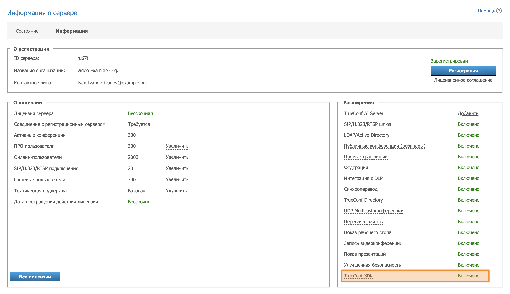
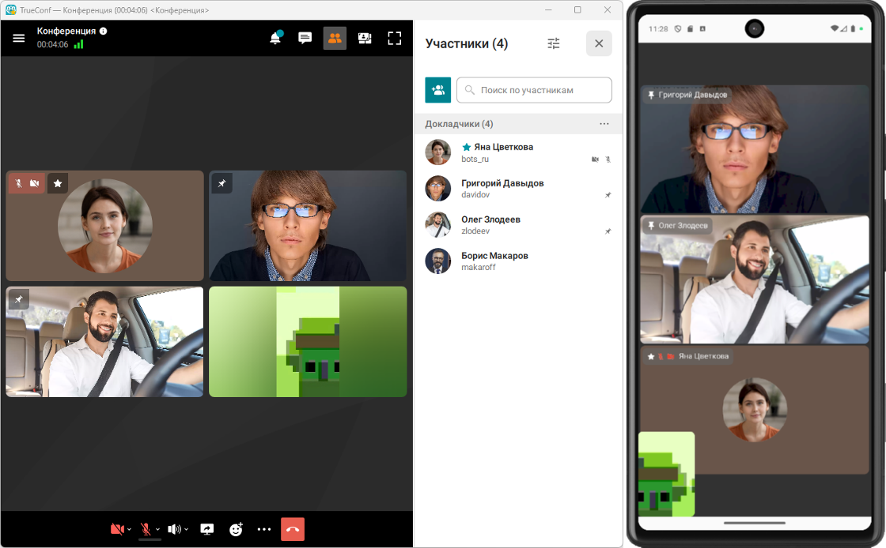
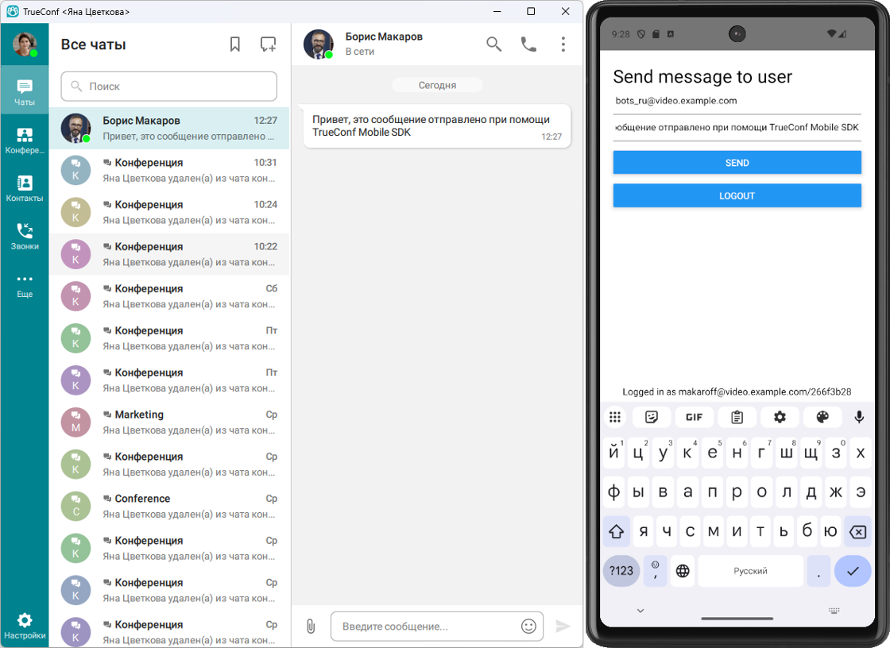

<p align="center">
  <a href="https://trueconf.com" target="_blank" rel="noopener noreferrer">
    <picture>
      <source media="(prefers-color-scheme: dark)" srcset="https://raw.githubusercontent.com/TrueConf/.github/refs/heads/main/logos/logo-cyrillic-dark.svg">
      
    </picture>
  </a>
</p>

<h1 align="center">TrueConf SDK для React Native</h1>

<p align="center">Программная библиотека для встраивания видеосвязи корпоративного уровня в мобильные приложения на React Native</p>

<p align="center">
    <a href="https://t.me/trueconf_talks" target="_blank">
        
    </a>
    <a href="#">
        
    </a>
</p>

<p align="center">
  <a href="./README.md">English</a> /
  <a href="./README-ru.md">Русский</a> /
  <a href="./README-de.md">Deutsch</a> /
  <a href="./README-es.md">Español</a>
</p>

<p align="center">
  
</p>

## Что такое TrueConf SDK для React Native?

**TrueConf SDK для React Native** — это кроссплатформенный программный фреймворк для интеграции видеосвязи корпоративного уровня в мобильные приложения на iOS и Android. Он позволяет разработчикам быстро добавить в свои проекты поддержку **видеозвонков**, **групповых видеоконференций**, чатов и гибко настраивать интерфейс под нужды бизнеса.

TrueConf SDK подключается к проекту как внешняя зависимость и предоставляет разработчику обширный набор API для полной интеграции с системой видеоконференцсвязи TrueConf. Он включает в себя:

* авторизацию пользователей;  
* совершение звонков и участие в конференциях;  
* получение и отслеживание статусов пользователей;  
* работу с мультимедиа;  
* кастомизацию интерфейсов и видеоокон.

### Область применения

TrueConf SDK подходит для создания:

* корпоративных мессенджеров с видеосвязью;
* решений для телемедицины;
* мобильных рабочих мест;
* отраслевых приложений для безопасности, образования промышленности и т.д.

### Технические особенности

* Подключение к серверу по протоколу **trueconf**.  
* Авторизация и регистрация в пользовательской учётной записи.  
* Подключение к групповым конференциям.  
* Звонки другим пользователям.  
* Чат внутри конференции.  
* Получение и отслеживание пользовательских статусов.  
* Кастомизация интерфейса и видеокомпонентов.

### Поддерживаемые фреймворки

TrueConf SDK доступен не только для нативных платформ, но и для кроссплатформенной разработки:

* .NET (C#)  
* React Native (JavaScript)  
* Cordova (JavaScript)  
* Qt (C++)

### Интеграция с экосистемой TrueConf

Наличие официального SDK гарантирует надёжное взаимодействие мобильных приложений с другими продуктами TrueConf, включая:

* сервер TrueConf Server;  
* другие клиентские приложения на базе SDK;  
* внешние системы через TrueConf Server API.

> [!TIP]
> Подключение мобильных приложений, созданных с использованием TrueConf Mobile SDK, возможно только к серверам, на которых [активировано расширение TrueConf SDK](https://trueconf.ru/docs/server/ru/admin/extensions/#%D0%BF%D0%BE%D0%B4%D0%B4%D0%B5%D1%80%D0%B6%D0%BA%D0%B0-sdk-%D0%BF%D1%80%D0%B8%D0%BB%D0%BE%D0%B6%D0%B5%D0%BD%D0%B8%D0%B8).

<p align="center">
  
</p>

## Получение доступа к TrueConf SDK

**TrueConf SDK** для мобильных приложений распространяется через **закрытый удалённый репозиторий**. Доступ к нему предоставляется **по индивидуальному запросу** — обратитесь в отдел продаж через форму обратной связи на сайте или по [официальным контактам](https://trueconf.ru/company/contacts.html).

**Как получить доступ:**

1. **Свяжитесь с отделом продаж TrueConf.** Уточните, что вы хотите получить доступ к TrueConf SDK и приватному Maven-репозиторию для Android.  
   Контакты: [https://trueconf.ru/company/contacts.html](https://trueconf.ru/company/contacts.html)
2. **Опишите ваш проект**. Представители TrueConf могут поинтересоваться целями использования SDK.
3. **Получите реквизиты доступа.** После рассмотрения запроса вы получите логин и пароль для подключения к Maven-репозиторию, а также к закрытому репозиторию с TrueConf SDK.

> [!NOTE]
> После предоставления доступа скопируйте папку `./React Native/TrueConf SDK` в корень данного проект с примерами.

## Структура проекта

Все ниже рассматриваемые примеры вы можете скачать с данного репозитория GitHub. Каждый пример проекта ReactNative имеет примерно следующую структуру:

<details>
  <summary>Структура проекта</summary>

<pre>
ReactNative/
│
├── Example1/                    // Проект №1 на React Native
│   ├── __tests__/               // Юнит-тесты
│   ├── .bundle/                 // Кеш Metro Bundler
│   ├── .idea/                   // Конфигурация JetBrains IDE
│   ├── .vscode/                 // Конфигурация Visual Studio Code
│   │
│   ├── android/                 // Каталог Android-приложения
│   │   ├── .gradle/
│   │   ├── .kotlin/
│   │   ├── app/                 // Java/Kotlin + ресурсы + манифест
│   │   ├── build/               // Артефакты сборки
│   │   ├── gradle/              // Обёртка Gradle
│   │   ├── build.gradle         // Сборка верхнего уровня
│   │   ├── gradle.properties    // Параметры
│   │   ├── gradlew              // Обёртка для Linux/macOS
│   │   ├── gradlew.bat          // Обёртка для Windows
│   │   └── settings.gradle      // Конфигурация модулей
│   │
│   ├── ios/                     // Каталог iOS-приложения
│   │   ├── Example1/            // Модуль iOS (AppDelegate, Info.plist и др.)
│   │   ├── Example1.xcodeproj/  // Xcode проект
│   │   ├── .xcode.env           // Переменные окружения
│   │   └── Podfile              // CocoaPods зависимости
│   │
│   ├── node_modules/            // Установленные npm/yarn зависимости
│   ├── src/screens              // Компоненты RN
│   │   ├── Call.js
│   │   ├── Connect.js
│   │   └── Login.js
│   │
│   ├── .eslintrc.js             // ESLint конфигурация
│   ├── .prettierrc.js           // Prettier конфигурация
│   ├── .watchmanconfig          // Watchman
│   ├── App.js                   // Главный компонент приложения
│   ├── index.js                 // Точка входа RN
│   ├── app.json                 // Конфигурация приложения (имя, иконки и пр.)
│   ├── babel.config.js          // Babel
│   ├── config.sh                // Скрипт настройки (опционально)
│   ├── Gemfile                  // Ruby зависимости (например, CocoaPods)
│   ├── jest.config.js           // Конфигурация тестов Jest
│   ├── metro.config.js          // Metro Bundler
│   ├── package.json             // Зависимости и npm/yarn скрипты
│   ├── README.md                // Документация проекта
│   ├── tsconfig.json            // TypeScript (если используется)
│   └── yarn.lock                // Фиксация версий
│
├── Example2/                    // Проект №2
├── Example3/                    // Проект №3
├── Example4/                    // ...
├── Example5/
├── Example6/
└── Example7/
</pre>
</details>

## Начало работы с TrueConf SDK

Для данного фреймворка TrueConf SDK упакован в npm пакет, который можно добавить в  
проект с помощью npm или yarn.

Создание и настройка проекта:

Если вы будете работать с примерами из данного GitHub репозитория, достаточно выполнить пункты 3-5.

1. Настройте окружение согласно официальной инструкции [React Native](https://reactnative.dev/docs/set-up-your-environment).  
2. Создать проект, выполнив команду:

```sh
npx @react-native-community/cli@latest init PROJECT_NAME --skip-install
```

3. Перейти в папку проекта (Example1, Example 2 и т. д.) и установить необходимые npm пакеты:

```sh
npm install
```

4. Установить модуль TrueConf SDK с помощью npm:

```sh
npm install PATH_TO_TRUECONF_MODULE --install-links=true
```  

или yarn:  

```sh
yarn add PATH_TO_TRUECONF_MODULE
```

5. Установить необходимые CocoaPods для iOS (только для компьютеров Mac):

```sh
cd ios && pod install
```

### Дополнительные шаги для Android

В **build.gradle** (`../Example*/android`) для всех проектов добавить maven-репозиторий, в котором находятся библиотеки Android SDK. `username` и `password` выдаются по запросу через <a href="mailto:sales@trueconf.com">менеджера</a>.

```gradle
allprojects {
   repositories {
       maven {
           credentials {
               username 'username'
               password 'password'
           }
           url 'https://sdk.trueconf.com/maven/repository/maven-public/'
       }
   }
}
```

До инициализации SDK (до вызова метода start) необходимо вызвать следующие методы:

* **registerApp** - в него нужно передать **Application** (или его наследника, который используется в проекте);
* **setFallbackActivity** - в него нужно передать класс **Activity**, к которому следует возвращаться в случае завершения звонка.

Это можно сделать, к примеру, в классе **MainApplication** (`../Example*/android/app/src/main/java/com/example7/MainApplication.kt`) в **onCreate**:

``` kotlin
override fun onCreate() {
    super.onCreate()
    SoLoader.init(this, OpenSourceMergedSoMapping)
    if (BuildConfig.IS_NEW_ARCHITECTURE_ENABLED) {
        // If you opted-in for the New Architecture, we load the native entry point for this app.
        load()
    }
    TrueConfSDK.getInstance().registerApp(this)
    TrueConfSDK.getInstance().fallbackActivity = MainActivity::class.java
}
```

### Дополнительные шаги для iOS

Необходимо добавить в **Info.plist** разрешения на использование камеры и микрофона непосредственно в Xcode проекте, либо выполнив следующие команды из папки проекта:

```sh
cd ios/PROJECT_NAME
plutil -insert NSCameraUsageDescription -string '' Info.plist
plutil -insert NSMicrophoneUsageDescription -string '' Info.plist
```

> [!TIP]
> Минимальная поддерживаемая версия Android - 7.0 (API 24), iOS - 15.0.

## Функции TrueConf SDK

Полную информацию о TrueConf SDK вы найдете в [официальной документации](https://trueconf.ru/docs/mobile-sdk/ru/overview/).

<details>
  <summary>Таблица с функциями </summary>
  <table>
  <thead>
    <tr>
      <th>Функция</th>
      <th>Параметры</th>
      <th>Возвращаемое значение</th>
    </tr>
  </thead>
  <tbody>
    <tr><td>stop</td><td>—</td><td>Останавливает SDK и освобождает ресурсы</td></tr>
    <tr><td>loginAs</td><td>user: string; pwd: string; encryptPassword: boolean; enableAutoLogin: boolean</td><td>boolean — true, если запрос авторизации отправлен</td></tr>
    <tr><td>logout</td><td>—</td><td>boolean — true, если запрос деавторизации отправлен</td></tr>
    <tr><td>callTo</td><td>user: string</td><td>boolean — true, если вызов отправлен на сервер</td></tr>
    <tr><td>joinConf</td><td>conf_ID: string</td><td>boolean — true, если присоединение к конференции начато</td></tr>
    <tr><td>hangup</td><td>forAll: boolean (по умолчанию true)</td><td>boolean — true, если вызов можно завершить</td></tr>
    <tr><td>acceptCall</td><td>accept: boolean</td><td>boolean — true, если ответ на вызов отправлен</td></tr>
    <tr><td>parseProtocolLink</td><td>cmd: string</td><td>Выполняет действия из строки-команды</td></tr>
    <tr><td>scheduleLoginAs</td><td>login: string; pwd: string; encryptPassword: boolean; callToUser: string; autoClose: boolean; loginTemp: boolean; loginForce: boolean; domain: string; serversList: string; isPublic: boolean</td><td>Последовательное выполнение авторизации и вызова</td></tr>
    <tr><td>muteMicrophone</td><td>mute: boolean</td><td>Включает или отключает микрофон</td></tr>
    <tr><td>muteCamera</td><td>mute: boolean</td><td>Включает или отключает камеру</td></tr>
    <tr><td>getMyId</td><td>—</td><td>string — идентификатор текущего пользователя или nil</td></tr>
    <tr><td>getMyName</td><td>—</td><td>string — отображаемое имя пользователя или nil</td></tr>
    <tr><td>isStarted</td><td>—</td><td>boolean — true, если SDK запущен</td></tr>
    <tr><td>isConnectedToServer</td><td>—</td><td>boolean — true, если есть соединение с сервером</td></tr>
    <tr><td>isLoggedIn</td><td>—</td><td>boolean — true, если пользователь авторизован</td></tr>
    <tr><td>isInConference</td><td>—</td><td>boolean — true, если клиент в конференции</td></tr>
    <tr><td>getUserStatus</td><td>user: string</td><td>UserPresStatus — статус другого пользователя</td></tr>
    <tr><td>isMicrophoneMuted</td><td>—</td><td>boolean — true, если микрофон отключён</td></tr>
    <tr><td>isCameraMuted</td><td>—</td><td>boolean — true, если камера отключена</td></tr>
    <tr><td>acceptRecord</td><td>accept: boolean; userID: string</td><td>Отвечает на запрос записи</td></tr>
    <tr><td>sendChatMessage</td><td>toID: string; text: string</td><td>boolean — true, если сообщение отправлено на сервер</td></tr>
  </tbody>
</table>
</details>

Ниже будут приведены примеры приложений с описанными выше функциями TrueConf SDK.

## Пример №1 - Демонстрация основных возможностей TrueConf SDK

Приложение где реализованы все основные функции TrueConf SDK:

* инициализация SDK и подключение к серверу;  
* авторизация и выход из учетной записи пользователя;  
* звонок абоненту сервера по его [TrueConf ID](https://trueconf.ru/docs/server/ru/admin/users/#user-id);  
* возможность принимать входящие аудио- и видеозвонки.

<p align="center">
  
  
  
</p>

В проекте **Example1** откройте папку **src/screens**, она отвечает за интерфейс приложения и содержит экраны `Connect.js` (подключение к серверу), `Login.js` (авторизация на сервере) и `Call.js` (звонок пользователю). Разберём интерфейс приложения на примере экрана `Connect.js`.

### Экраны приложения

В файле `Connect.js` задается состояние переменных. Если в `serverName` указать адрес TrueConf Server, подключение произойдет автоматически. Данная поведение распространяется для всех экранов проектов Example.

```js
state = {
        serverName: "",
        serverError: null
    }
```

Кнопка `Connect` вызывает метод `onPressConnect`, который проверяет входные данные. Если поле `serverName` пустое, пользователю показывается ошибка. Если данные валидны, управление передается callback-функции `onConnect`.

```js
onPressConnect = () => {
        if (this.state.serverName.trim() === "") {
            this.setState({ serverError: "Server is required" });
          } else {
            this.props.onConnect(this.state.serverName);
          }
    }
```

Далее рассмотрим визуальное наполнение экрана `Connect.js`, здесь расположены следующие компоненты: заголовок, поле ввода, текст ошибки и кнопка подключения.

**Пример кода:**

```js
render() {
        return (
            <View style={{padding: 20}}>
                <Text
                    style={{fontSize: 27, color: "black"}}>
                    Connect to server
                </Text>
                <TextInput
                    style={{height: 40, borderBottomColor: 'gray', borderBottomWidth: 1, color: "black"}}
                    placeholder='Server name or IP'
                    placeholderTextColor='gray'
                    onChangeText={(serverName) => this.setState({serverName})}
                    value={this.state.serverName} />
                {!!this.state.serverError &&
                (
                    <Text
                        style={{ color: "red" }}>
                        {this.state.serverError}
                    </Text>
                )}
                <View style={{margin:7}} />
                <Button
                    onPress={this.onPressConnect}
                    title="Connect" />
            </View>
        )
    }
```

Теперь перейдем к главному классу приложения `App.js`. Рассмотрим основные участки кода.

Импорт модуля TrueConf SDK и экранов приложения:

```js
import TrueConfSDK from 'react-native-trueconf-sdk';
import Call from './src/screens/Call';
import Login from './src/screens/Login';
import Connect from './src/screens/Connect';
```

В объекте `state` хранятся два ключевых флага:

* `connected` – отвечает за подключение к серверу;  
* `loggedIn` – показывает, авторизован ли пользователь.

Для отображения экранов `Connect.js` и `Login.js`, соответствующие ключи `connected` и `loggedIn` в объекте `state` должны иметь значение `false`.

```js
state = {
    loggedIn: false,
    connected: false,
    serverName: "",
    status: STATUSES.disconnected
  }
```

Это позволяет поэтапно управлять интерфейсом в зависимости от текущего состояния подключения и авторизации пользователя.

### Обработка событий от TrueConf SDK

В данном классе сохраняется имя сервера (отображается на экране **`Login.js`**) и обновляется статус подключения (`Connected to` или `No connection`) при каждом изменении состояния соединения.

```js
onServerStatus = (event) => {
    this.state.serverName = event.serverName;
    this.setState({ connected: event.connected });
    this.setState({ status: event.connected? STATUSES.connected + event.serverName : STATUSES.disconnected });
  }
```

Ключ `LoggedIn` объекта состояния `onLogin` вызывается SDK при изменении статуса авторизации пользователя. Он обновляет состояние компонента для перерисовки интерфейса:

* `loggedIn` – устанавливается в значение, полученное от SDK (`event.loggedIn`);
* `status` – динамически вычисляемая строка для отображения в нижней части интерфейса. Показывает текущий статус приложения (`Logged in as <userID>` или `Connected to <serverName>`).

```js
 onLogin = (event) => {    
    this.setState({ loggedIn: event.loggedIn });
    this.setState({ status: event.loggedIn? STATUSES.loggedIn + event.userID : STATUSES.connected + this.state.serverName });
}
```

При выходе ключ **`LoggedIn`** принимает значения **`false`** и отображается статус **Connected to**.

```js
onLogout = () => {
    this.setState({ loggedIn: false });
    this.setState({ status: STATUSES.connected + this.state.serverName });
  }
```

Чтобы приложение с множеством экранов (`src/screens`) могло переключаться между ними, необходимо задать алгоритм. Логика переключения экранов приложения следующая:

1\. Если авторизация прошла успешна, то переход на экран **Call**.  
2\. Если подключение к серверу прошло успешно, то переход к окну **Login**. Иначе, возврат к **Connect**.

```js
screenForState() {
    if(this.state.loggedIn) {
      return <Call
        onCall={callID => TrueConfSDK.callTo(callID)}
        onLogout={() => TrueConfSDK.logout()}/>
    } else {
      if(this.state.connected) {
        return <Login
          onLogin={(login, password) => TrueConfSDK.loginAs(login, password, true, false)}
          onDisconnect={() => this.setState({ connected: false })}/>
      } else {
        return <Connect
          onConnect={server => {
            TrueConfSDK.start(server);
            this.initEventsListeners();
            console.log('Start TrueConf SDK');
          }
        } />
      }
    }
  }
```

Для экранов `Connect.js`, `Login.js` и `Call.js` необходимо задать единые границы отображения интерфейса приложения. Эти параметры применяются ко всем экранам:

* `SafeAreaView` — контейнер верхнего уровня, который ограничивает область отображения в пределах безопасной зоны устройства.  
* Основной контент (`this.screenForState()`) занимает 95% высоты экрана.  
* Статусная строка (`status` из `state`) закреплена внизу и занимает 5% высоты. Она центрируется по горизонтали с помощью `alignItems: 'center'`.

```js
render() {
    return (
      <SafeAreaView style={{flex: 1, backgroundColor: 'white'}}>
        <StatusBar barStyle={'dark-content'} />
        <View style={{flex: 0.95}}>
          { this.screenForState() }
        </View>
        <View style={{flex: 0.05, alignItems: 'center'}}>
            <Text>{this.state.status}</Text>
        </View>
      </SafeAreaView>
    )
  }
```

В объекте `STATUSES` задаются константы статусов для отображения в нижней части интерфейса. Каждому ключу (`disconnected`, `connected`, `loggedIn`) соответствует подпись, которая отображается пользователю. Вы можете использовать свои собственные ключи и текстовые значения в соответствии с требованиями приложения.

```js
const STATUSES = {
  disconnected: 'No connection',
  connected: 'Connected to ',
  loggedIn: 'Logged in as ',
};
```

### Работа с  iOS устройствами

В iOS для вызова системного UI нужно использовать [CallKit](https://developer.apple.com/documentation/callkit/). Мы не будем этого делать в данном примере и воспользуемся более простым способом – использование `Alert.alert()`.

```js
onInvite = (event) => {
    if (Platform.OS === 'ios'){
      Alert.alert(
        'Incoming call',
        'Accept incoming call from ' + event.userID,
        [{
            text: 'Reject',
            onPress: () => TrueConfSDK.acceptCall(false),
            style: 'cancel',
          },
          {text: 'Accept', onPress: () => TrueConfSDK.acceptCall(true)},
        ],
      );
    }
  }
```

Для интеграции React Native с `CallKit` вы можете использовать следующие библиотеки:

* react-native-callkeep
* react-native-voip-call

## Пример №2 \- Демонстрация работы с trueconf-ссылками

Разберём пример, в котором приложение позволяет подключиться к TrueConf Server и инициировать вызов с помощью URI-схемы **trueconf** (например, `trueconf:ivanov`). Это может быть как звонок конкретному пользователю по его TrueConf ID, так и подключение к групповой конференции по её идентификатору. Авторизация и соединение выполняются автоматически — логин и параметры сервера передаются внутри ссылки. Вызов обрабатывается с помощью метода **`parseProtocolLink`**, которому передается строка вызова в формате **String**.

На экране `Parse.js`, компонент `TextInput` отображает поле для ввода ссылки формата `trueconf:`. Введённый пользователем текст сохраняется в состоянии компонента под ключом `plink`.

```js
<TextInput
      style={{height: 40, borderBottomColor: 'gray', borderBottomWidth: 1, color: "black"}}
      placeholder='Protocol link'
      placeholderTextColor='gray'
      onChangeText={(plink) => this.setState({plink})}
      value={this.state.plink}
/>
```

Компонент `<Parse/>` рендерится с пропом `onParse`, который вызывается при подтверждении ввода пользователем (экран `Parse.js`). В данном случае при срабатывании `onParse` переданная строка `plink` передаётся в метод `TrueConfSDK.parseProtocolLink()` для обработки.

```js
<Parse
      onParse={plink => TrueConfSDK.parseProtocolLink(plink)}
/>
```

Для подключения к конференции через ссылку по протоколу trueconf, необходимо параметры:

* `[confID]` – ID конференции;  
* `[serverID]` – ID сервера;  
* `[login]` – логин (TrueConf ID) пользователя, которым необходимо авторизоваться на указанном сервере;  
* `[password]` – пароль пользователя, которым необходимо авторизоваться на указанном сервере.

```
trueconf:[confID]@[serverID]%23vcs&h=serverID&login=[login]&password=[password]&encrypt=1&force=1
```

Например, для авторизации пользователем на сервере **truevideo.example.com** и звонка в конференцию на сервере **video.example.com** необходимо ввести:

```
trueconf:\c\737734033583@video.example.com%23vcs&h=truevideo.example.com&login=user&password=pswd&encrypt=1&force=1
```

## Пример №3 \- Работа со статусами пользователей

Пример демонстрирует, как отслеживать статусы пользователей на сервере, а также добавление пользователя для последующего мониторинга его доступности.

На экране `AddUser.js`, компонент `TextInput` позволяет ввести TrueConf ID пользователя, статус которого требуется отслеживать. Введенное значение сохраняется в состоянии компонента для последующей обработки.

```js
<TextInput
      style={{height: 40, borderBottomColor: 'gray', borderBottomWidth: 1, color: "black"}}
      placeholder='User ID'
      placeholderTextColor='gray'
      onChangeText={(userID) => this.setState({userID})}
      value={this.state.userID}
/>
```

В главном компоненте `App.js`, при добавлении нового пользователя (через компонент `AddUser`) его ID передается в метод `TrueConfSDK.getUserStatus()`, который инициирует запрос статуса к серверу.

```js
<View style={{flex: 1}}>
          <AddUser onAdd={userID => TrueConfSDK.getUserStatus(userID)}/>
          <UsersList users={this.state.users}/>
        </View>
```

При получение статуса вызывается `onUserStatusUpdate` и обновляет/добавляет пользователя в список `state.users`.

```js
onUserStatusUpdate = (event) => {
    let exist = false;
    let list = this.state.users;
    for(let i = 0; i < list.length; i++) {
      if(list[i].userID === event.userID) {
        list[i].state = event.state;
        exist = true;
        break;
      }
    }
    if(!exist) {
      list.push({ userID: event.userID, state: event.state});
    }
    this.setState({ users: list });
  }
```

### Статусы пользователей

На экране `UserList.js`, метод `getStatusString` преобразует числовые коды статусов пользователей, возвращаемые SDK, в текстовые значения для отображения в интерфейсе.

```js
getStatusString = (state) => {
    switch(state) {
      case -127:
        return "Undefine";
      case -1:
        return "Unknown";
      case 0:
        return "Offline";
      case 1:
        return "Online";
      case 2:
      case 3:
      case 4:
      case 5:
        return "Busy";
    }
  }
```

Метод `getStatusColor` согласовывает цвет статусов в интерфейсе с числовым кодом полученным от SDK.

```js
  getStatusColor = (state) => {
    switch(state) {
      case -127:
      case -1:
        return "gray";
      case 0:
        return "red";
      case 1:
        return "green";
      case 2:
      case 3:
      case 4:
      case 5:
        return "orange";
    }
  }
```

## Пример №4 \- Работа с групповыми конференциями

Данный пример демонстрирует подключение к многопользовательской видеоконференции с помощью метода **joinConf(conferenceId)**. В отличие от вызова конкретного пользователя через **callTo(userId) используемый в** [Примере №1](#пример-1---демонстрация-основных-возможностей-trueconf-sdk), здесь используется идентификатор конференции **(String confId)** для подключения к уже созданной сессии на сервере.

Интерфейс практически не отличается от [Примера №1](#пример-1---демонстрация-основных-возможностей-trueconf-sdk), за исключением того, что используется метод `joinConf(...) вместо callTo(...)`.

<p align="center">
  
  
  
</p>

> [!Note]
> На текущий момент поддерживается только подключение к уже существующим конференциям.

На экране `Join.js` метод `onPressJoin` выполняет валидацию и проверяет, что поле ввода не пустое; если оно пустое, выводится `ConfIDError`. Если данные валидны, вызывает `onJoin`, переданный из родительского компонента и инициирует процесс подключения:

```js
onPressJoin = () => {
        if (this.state.confID.trim() === "") {
            this.setState({ confIDError: "Conf ID is required" });
          } else {
            this.props.onJoin(this.state.confID);
          }
    }
```

В основном компоненте `App.js`, в методе `screenForState` `confTime` передаётся в компонент `Join` как переменная состояния `this.state.confTimeStr`, содержащая сведения о продолжительности конференции.

```js
screenForState() {
    if(this.state.loggedIn) {
      return <Join
        onJoin={confID => TrueConfSDK.joinConf(confID)}
        onLogout={() => TrueConfSDK.logout()}
        confTime={this.state.confTimeStr}
        />
```

Если `Conference ID` указан корректно, будет выполнено подключение к соответствующей конференции:

<p align="center">
  
</p>

## Пример №5 \- Кастомизация интерфейса

В TrueConf SDK для React Native вы можете расширить панель управления звонком, добавив собственные кнопки через интерфейс `addExtraButton()`. Это позволяет запускать дополнительные действия прямо из окна конференции. В нашем примере это открытие модального окна с версией React Native.

<p align="center">
  
</p>

### Как это работает?

Пользовательские кнопки добавляются методом `TrueConfSDK.addExtraButton()`. Эти кнопки появляются в интерфейсе конференции при нажатии на кнопку “троеточие” (⋯) — это правый элемент панели управления во время звонка.  
Также, вы можете заменить стандартные иконки (например, микрофон, камера, динамик, кнопка завершения вызова и т.д.), вы можете заменить ресурсы изображений в папке:

* для Android (формат .xml) – **/android/app/src/main/res/drawable**;  
* для iOS (формат .svg) – **/ios/Example5/Images.xcassets**.

> [!Warning]
> Имена файлов должны точно соответствовать ожидаемым SDK идентификаторам.

Доступные для изменения имена элементов интерфейсов:

| Идентификатор                      | Описание                                                            |
| ---------------------------------- | ------------------------------------------------------------------- |
| `call_end`                         | завершение звонка                                                   |
| `camera_on_new` / `camera_off_new` | камера в состоянии вкл/выкл                                         |
| `mic_on_new` / `mic_off_new`       | микрофон в состоянии вкл/выкл                                       |
| `sound_off_new`                    | устройство вывода звука в состоянии выкл                            |
| `sound_on_new`                     | текущее устройство вывода звука — громкий динамик                   |
| `receiver_sound`                   | текущее устройство вывода звука — разговорный динамик               |
| `airpods_device`                   | текущее устройство вывода звука — беспроводные наушники AirPods     |
| `airpodspro_device`                | текущее устройство вывода звука — беспроводные наушники AirPods Pro |
| `bluetooth_device`                 | текущее устройство вывода звука — bluetooth устройство              |
| `wired_device`                     | текущее устройство вывода звука — проводные наушники                |
| `more_new`                         | кнопка “троеточие”, которая открывает список дополнительных кнопок  |
| `camera_swap`                      | переключение камеры с фронтальной на заднюю и наоборот              |
| `more_btn`                         | выбор камеры и вкл/выкл фонарика                                    |

В главном компоненте `App.js`, метод `addExtraButton()` добавляет пользовательскую кнопку в интерфейс видеозвонка. Кнопка появляется после успешного подключения к серверу.

```js
return <Connect
          onConnect={server => {
            TrueConfSDK.start(server);
            this.initEventsListeners();
            TrueConfSDK.addExtraButton("React info");
            console.log('Start TrueConf SDK');
          }
        } />
```

Метод `addEventListener` связывает обработчик `onClickListener` с событием `onExtraButtonPressed`.

```js
TrueConfSDK.addEventListener('onExtraButtonPressed', this.onClickListener);
```

Метод `onClickListener` вызывает нативный API SDK `showAlertPage` для отображения полноэкранного модального окна с информацией о версии React Native.

```js
onClickListener = () => {
    TrueConfSDK.showAlertPage("React version: " + React.version);
  }
```

<p align="center">
  
  
</p>

## Пример №6 - Чат

Этот пример демонстрирует реализацию текстового чата, включая отправку сообщений с помощью `sendChatMessage()` и обработку входящих событий через `onChatMessageReceived()`.

В этом материале мы разберем, как устроен чат в мобильном приложении с использованием TrueConf SDK, и покажем, как происходит отправка, отображение и обработка сообщений с точки зрения архитектуры приложения.

### Получение сообщений

При входящем сообщении, компонент `App.js` запускает событие для отображения экранного уведомления. В уведомлении отображается подпись (`New message`), полный TrueConf ID отправителя (`fromUserID`) и содержание сообщения (`message`).

```js
onChatMessageReceived = (event) => {
   Alert.alert("New message", event.fromUserID + ": " + event.message, [{text: 'OK', style: 'cancel'}]);
 }
```

### Отправка сообщений

На экране `Chats.js`, метод `onPressSend` сохраняет текст введённый в поля ввода `message` и `userID` (обрабатывается полный TrueConf ID, например: `petrov@vcs.trueconf.com`) и инициирует отправку текстового сообщения через TrueConf SDK.

```js
  onPressSend = () => {
        if (this.state.message.trim() === "") {            
            this.setState({ messageError: this.state.message.trim() === ""? "Message is required" : null });
        } else {
            this.props.onSend(this.state.userID, this.state.message);
        }
    }
```

Компонент `Chat` получает функцию `onSend`, которая вызывает метод `sendChatMessage` с указанным `userID` и текстом сообщения.

```js
   if(this.state.loggedIn) {
      return <Chat
        onSend={(userID, message) => TrueConfSDK.sendChatMessage(userID, message)}
        onLogout={() => TrueConfSDK.logout()}/>
```

Если полный `userID` указан корректно, то сообщение будет доставлено пользователю.

<p align="center">
  
</p>

## Пример №7 – Кастомизация вывода видеоокон в конференции

В примере реализована возможность размещения селфвью и раскладку с участниками конференции в отдельных окнах. Возможна самостоятельная реализация кнопок управления конференцией, настройка оборудования перед началом конференции, а также замена окон исходящего и входящего вызовов на кастомные.  

<p align="center">
  
</p>

На экран `Join.js` добавлены кнопки управления **Hangup**, **Mic**, **Cam** соответствующие методам SDK:

* `TrueConfSDK.hangup`;  
* `TrueConfSDK.muteMicrophone`;  
* `TrueConfSDK.muteCamera`.

```js
<View style={{flexDirection: 'row'}}>
                    <View style={{flex:1, padding: 10}}>
                        <Button
                            title="Hangup"
                            onPress={this.props.onHangup} />
                    </View>
                    <View style={{flex:1, padding: 10}}>
                        <Button
                            title="Mic"
                            onPress={this.props.onMic} />
                    </View>
                    <View style={{flex:1, padding: 10}}>
                        <Button
                            title="Cam"
                            onPress={this.props.onCam} />
                    </View>
                </View>
```

Метод `initCustomViews()` активирует режим кастомного рендеринга видеоокон, позволяя заменить стандартный интерфейс конференции пользовательской реализацией.

```js
componentDidMount() {
        TrueConfSDK.initCustomViews();
    }
```

### Кастомизация раскладки для Android

Для редактирования шаблона раскладки откройте `fragment_conference_cast.xml`, полный путь — `../node_modules/react-native-trueconf-sdk/android/src/main/res/layout/fragment_conference_cast.xml`.

> [!TIP]
>
> - **LinearLayout** отвечает за вид вашего видео.  
> - **RelativeLayout** отвечает видео участников.

```xml
<RelativeLayout
        android:id="@+id/gfxFragmentCast"
        android:layout_width="0dp"
        android:layout_height="match_parent"
        android:background="@color/Green"
        app:layout_constraintBottom_toBottomOf="parent"
        app:layout_constraintEnd_toStartOf="@id/insert_point"
        app:layout_constraintStart_toStartOf="parent" />


    <LinearLayout
        android:id="@+id/insert_point"
        android:layout_width="150dp"
        android:layout_height="200dp"
        android:background="@color/Orange"
        android:orientation="horizontal"
        app:layout_constraintBottom_toBottomOf="parent"
        app:layout_constraintEnd_toEndOf="parent" />
```

Для того, чтобы добавить окно `SelfView`:

1. В макете кастомного фрагмента добавить `layout` (например, `LinearLayout`, `RelativeLayout` или любой другой `ViewGroup`).  
2. В коде вызвать метод `addGFXSelfViewSurface`, передав в качестве параметра тот самый `ViewGroup`, в котором будет отображаться `SelfView`.

Для того, чтобы удалить окно `SelfView` нужно вызвать метод `removeGFXSelfViewSurface`,  который в качестве параметра принимает `ViewGroup`, тот самый `layout`, в котором было `selfview`.

```js
@Override
    public void onViewCreated(@NonNull View view, @Nullable Bundle savedInstanceState) {
        super.onViewCreated(view, savedInstanceState);


        RelativeLayout gfxFragmentCast = view.findViewById(R.id.gfxFragmentCast);
        ViewGroup insertPoint = view.findViewById(R.id.insert_point);


        addGFXFragment(gfxFragmentCast);
        addGFXSelfViewSurface(insertPoint);
    }
```

#### Настройка микрофона

Чтобы установить состояние микрофона по умолчанию при звонке, необходимо вызвать `TrueConfSDK.getAudioDeviceController()`.  
Чтобы микрофон был выключен по умолчанию вызовите:

```js
 public void muteMicrophone(boolean mute) {
        TrueConfSDK.getAudioDeviceController().muteMicrophone(mute);
    }
```

#### Настройка камеры

Чтобы установить состояние камеры по умолчанию при звонке, необходимо вызвать `TrueConfSDK.getVideoDeviceController()`.  
Чтобы камера была выключена по умолчанию вызовите:

```js
public void muteCamera(boolean mute) {
    TrueConfSDK.getVideoDeviceController().muteCamera(mute);
}
```

#### Изменение размеров и координат видео

Для отображения кастомной раскладки необходимо в `RNTrueConfSdkModule.java` создать переменную типа `WindowManager.LayoutParams`, задать все нужные параметры и вызвать метод `setCallLayoutParams`.

```js
@ReactMethod
    public void initCustomViews() {
        final float scale = context.getResources().getDisplayMetrics().density;
        int height = (int) (400 * scale + 0.5f);
        WindowManager.LayoutParams params = new WindowManager.LayoutParams();
        params.width = WindowManager.LayoutParams.MATCH_PARENT;
        params.height = height;
        params.gravity = Gravity.BOTTOM;
        params.y = 150;
        TrueConfSDK.getCallWindowController().setCallLayoutParams(params);
        TrueConfSDK.getCallScreenController().setConferenceFragment(new ConferenceFragmentCast(R.layout.fragment_conference_cast));
    }
```

### Кастомизация раскладки для iOS

Для редактирования шаблона раскладки откройте `RNTrueConfSdk.m`, полный путь — `../node_modules/react-native-trueconf-sdk/ios/RNTrueConfSdk.m`.

* контейнер `self.xsview` отвечает за вид вашего видео;  
* контейнер `self.xview` отвечает видео участников.

```objc
RCT_EXPORT_METHOD(initCustomViews)
{
   UIView* rootView = [UIApplication sharedApplication].delegate.window.rootViewController.view;


   self.xsview = [[UIView alloc] init];
   [rootView addSubview:self.xsview];
   self.xsview.translatesAutoresizingMaskIntoConstraints = NO;
   self.xsview.backgroundColor = [UIColor clearColor];
   [self.xsview.bottomAnchor constraintEqualToAnchor:rootView.safeAreaLayoutGuide.bottomAnchor constant: -48].active = YES;
   [self.xsview.trailingAnchor constraintEqualToAnchor:rootView.trailingAnchor constant: 0].active = YES;
   [self.xsview.heightAnchor constraintEqualToConstant: 200].active = YES;
   [self.xsview.widthAnchor constraintEqualToConstant: 150].active = YES;
  
   self.xview = [[UIView alloc] init];
   [rootView addSubview:self.xview];
   self.xview.translatesAutoresizingMaskIntoConstraints = NO;
   self.xview.backgroundColor = [UIColor clearColor];
   [self.xview.bottomAnchor constraintEqualToAnchor:rootView.safeAreaLayoutGuide.bottomAnchor constant: -48].active = YES;
   [self.xview.leadingAnchor constraintEqualToAnchor:rootView.leadingAnchor constant: 0].active = YES;
   [self.xview.trailingAnchor constraintEqualToAnchor:self.xsview.leadingAnchor constant: 0].active = YES;
   [self.xview.heightAnchor constraintEqualToAnchor:rootView.heightAnchor multiplier: 0.5].active = YES;


   self.tcsdk.windowsDelegate = self;


   self.tcsdk.xview = self.xview;
   self.tcsdk.xsview = self.xsview;
}
```