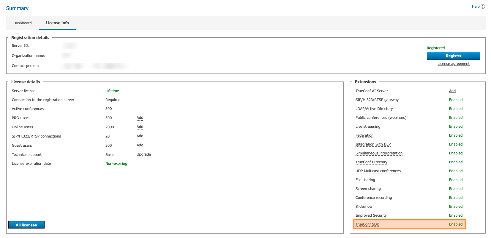

<p align="center">
  <a href="https://trueconf.com" target="_blank" rel="noopener noreferrer">
    <picture>
      <source media="(prefers-color-scheme: dark)" srcset="https://raw.githubusercontent.com/TrueConf/.github/refs/heads/main/logos/logo-dark.svg">
      
    </picture>
  </a>
</p>

<h1 align="center">TrueConf SDK for React Native</h1>

<p align="center">Software library for embedding enterprise-grade video conferencing into mobile applications on React Native</p>

<p align="center">
    <a href="https://t.me/trueconf_chat" target="_blank">
        
    </a>
    <a href="https://discord.gg/2gJ4VUqATZ">
        
    </a>
    <a href="#">
        
    </a>
</p>

<p align="center">
  <a href="./README.md">English</a> /
  <a href="./README-ru.md">Русский</a> /
  <a href="./README-de.md">Deutsch</a> /
  <a href="./README-es.md">Español</a>
</p>

<p align="center">
  
</p>

## What is TrueConf SDK for React Native?

**TrueConf SDK for React Native** is a cross-platform software framework for
integrating enterprise-level video conferencing into mobile applications on iOS
and Android. It enables developers to quickly add support for **video calls**,
**group video conferences**, and chats to their projects, and to customize the
interface to meet business needs.

TrueConf SDK is integrated into the project as an external dependency and
provides developers with a comprehensive set of APIs for full integration with
the TrueConf video conferencing system. It includes:

* user authentication;
* making calls and participating in conferences;
* retrieving and tracking user statuses;
* working with multimedia;
* customization of interfaces and video layout.

### Scope of Application

TrueConf SDK is suitable for creating:

* corporate messengers with video conferencing;
* telemedicine solutions;
* mobile workstations;
* industry applications for security, education, manufacturing, etc.

### Technical features

* Connecting to the server via the **trueconf** protocol.
* Authorization and registration in the user account.
* Connecting to group conferences.
* Calls to other users.
* Chat within the conference.
* Retrieving and tracking user statuses.
* Customization of the interface and video components.

### Supported Frameworks

TrueConf SDK is available not only for native platforms but also for
cross-platform development:

* .NET (C#)
* React Native (JavaScript)
* Cordova (JavaScript)
* Qt (C++)

### Integration with the TrueConf ecosystem

The availability of an official SDK ensures reliable interaction of mobile
applications with other TrueConf products, including:

* TrueConf Server;
* other client applications based on the SDK;
* external systems via TrueConf Server API.

> [!TIP] Mobile applications created using the TrueConf Mobile SDK can only
connect to servers where the [TrueConf SDK extension is
enabled](https://trueconf.com/docs/server/en/admin/extensions/#support-for-sdk-applications).

<p align="center">
  
</p>

## Accessing the TrueConf SDK

**TrueConf SDK** for mobile applications is distributed through a **private
remote repository**. Access is granted **upon individual request** — please
contact the sales department via the feedback form on the website or through
[official contacts](https://trueconf.com/company/contacts.html).

**How to Access:**

1. **Contact the TrueConf sales department.** Specify that you want access to the
TrueConf SDK and the private Maven repository for Android. Contact details:
<https://trueconf.com/company/contacts.html>
1. **Describe your project**. TrueConf representatives may inquire about the
purposes for using the SDK.
1. **Obtain access credentials.** After your request is reviewed, you will
receive a username and password to connect to the Maven repository, as well
as access to the private repository with the TrueConf SDK.

> [!NOTE]
> After granting access, copy the `./React Native/TrueConf SDK` folder to the root of this example project.

## Project structure

All the examples discussed below can be downloaded from this GitHub repository.
Each React Native project example has approximately the following structure:

<details>
  <summary>Project structure</summary>

<pre>
ReactNative/
│
├── Example1/                    // React Native project #1
│   ├── __tests__/               // Unit tests
│   ├── .bundle/                 // Metro Bundler cache
│   ├── .idea/                   // JetBrains IDE configuration
│   ├── .vscode/                 // Visual Studio Code configuration
│   │
│   ├── android/                 // Android app directory
│   │   ├── .gradle/
│   │   ├── .kotlin/
│   │   ├── app/                 // Java/Kotlin sources + resources + manifest
│   │   ├── build/               // Build artifacts
│   │   ├── gradle/              // Gradle wrapper
│   │   ├── build.gradle         // Top-level build script
│   │   ├── gradle.properties    // Gradle properties
│   │   ├── gradlew              // Wrapper script for Linux/macOS
│   │   ├── gradlew.bat          // Wrapper script for Windows
│   │   └── settings.gradle      // Module configuration
│   │
│   ├── ios/                     // iOS app directory
│   │   ├── Example1/            // iOS module (AppDelegate, Info.plist, etc.)
│   │   ├── Example1.xcodeproj/  // Xcode project
│   │   ├── .xcode.env           // Environment variables
│   │   └── Podfile              // CocoaPods dependencies
│   │
│   ├── node_modules/            // Installed npm/yarn dependencies
│   ├── src/screens              // React Native screens/components
│   │   ├── Call.js
│   │   ├── Connect.js
│   │   └── Login.js
│   │
│   ├── .eslintrc.js             // ESLint configuration
│   ├── .prettierrc.js           // Prettier configuration
│   ├── .watchmanconfig          // Watchman configuration
│   ├── App.js                   // Main application component
│   ├── index.js                 // React Native entry point
│   ├── app.json                 // App configuration (name, icons, etc.)
│   ├── babel.config.js          // Babel configuration
│   ├── config.sh                // Setup script (optional)
│   ├── Gemfile                  // Ruby dependencies (e.g., CocoaPods)
│   ├── jest.config.js           // Jest test configuration
│   ├── metro.config.js          // Metro Bundler configuration
│   ├── package.json             // Dependencies and npm/yarn scripts
│   ├── README.md                // Project documentation
│   ├── tsconfig.json            // TypeScript configuration (if used)
│   └── yarn.lock                // Locked dependency versions
│
├── Example2/                    // Project #2
├── Example3/                    // Project #3
├── Example4/                    // ...
├── Example5/
├── Example6/
└── Example7/
</pre>
</details>

## Getting Started with TrueConf SDK

For this framework, TrueConf SDK is packaged as an npm package, which can be
added to a project using npm or yarn.

Project creation and configuration:

If you work with examples from this GitHub repository, it is sufficient to
complete steps 3-5.

1. Set up the environment according to the official [React
Native](https://reactnative.dev/docs/set-up-your-environment) guide.
1. Create a project by executing the command:

```sh
npx @react-native-community/cli@latest init PROJECT_NAME --skip-install
```

1. Navigate to the project folder (Example1, Example2, etc.) and install the
required npm packages:

```sh
npm install
```

1. Install the TrueConf SDK module using npm:

```sh
npm install PATH_TO_TRUECONF_MODULE --install-links=true
```

or yarn:

```sh
yarn add PATH_TO_TRUECONF_MODULE
```

1. Install the necessary CocoaPods for iOS (Mac computers only):

```sh
cd ios && pod install
```

### Additional steps for Android

In **build.gradle** (`../Example*/android`), add the Maven repository containing
the Android SDK libraries for all projects. The `username` and `password` are
provided upon request through a <a href="mailto:sales@trueconf.com">manager</a>.

```gradle
allprojects {
   repositories {
       maven {
           credentials {
               username 'username'
               password 'password'
           }
           url 'https://sdk.trueconf.com/maven/repository/maven-public/'
       }
   }
}
```

Before initializing the SDK (before calling the start method), it is necessary to
call the following methods:

* **registerApp** - you need to pass **Application** (or its subclass used in the
project) to it;
* **setFallbackActivity** - specify the **Activity** class to which the
application should return upon call termination.

This can be done, for example, in the **MainApplication** class
(`../Example*/android/app/src/main/java/com/example7/MainApplication.kt`) within
**onCreate**:

```kotlin
override fun onCreate() {
    super.onCreate()
    SoLoader.init(this, OpenSourceMergedSoMapping)
    if (BuildConfig.IS_NEW_ARCHITECTURE_ENABLED) {
        // If you opted-in for the New Architecture, we load the native entry point for this app.
        load()
    }
    TrueConfSDK.getInstance().registerApp(this)
    TrueConfSDK.getInstance().fallbackActivity = MainActivity::class.java
}
```

### Additional steps for iOS

You need to add camera and microphone permissions to **Info.plist** directly in
the Xcode project or by executing the following commands from the project folder:

```sh
cd ios/PROJECT_NAME
plutil -insert NSCameraUsageDescription -string '' Info.plist
plutil -insert NSMicrophoneUsageDescription -string '' Info.plist
```

> [!TIP] The minimum supported version is Android 7.0 (API 24), iOS 15.0.

## TrueConf SDK Features

You can find complete information about the TrueConf SDK in the [official
documentation](https://trueconf.com/docs/mobile-sdk/en/overview/).

<details>
  <summary>Function table</summary>
  <table>
  <thead>
    <tr>
      <th>Function</th>
      <th>Parameters</th>
      <th>Return value</th>
    </tr>
  </thead>
  <tbody>
    <tr><td>stop</td><td>—</td><td>Stops the SDK and releases resources</td></tr>
    <tr><td>loginAs</td><td>user: string; pwd: string; encryptPassword: boolean; enableAutoLogin: boolean</td><td>boolean — true if the authorization request has been sent</td></tr>
    <tr><td>logout</td><td>—</td><td>boolean — true if the logout request has been sent</td></tr>
    <tr><td>callTo</td><td>user: string</td><td>boolean — true if the call has been sent to the server</td></tr>
    <tr><td>joinConf</td><td>conf_ID: string</td><td>boolean — true if joining the conference has started</td></tr>
    <tr><td>hangup</td><td>forAll: boolean (default true)</td><td>boolean — true if the call can be terminated</td></tr>
    <tr><td>acceptCall</td><td>accept: boolean</td><td>boolean — true if the call response has been sent</td></tr>
    <tr><td>parseProtocolLink</td><td>cmd: string</td><td>Executes actions encoded in the command string</td></tr>
    <tr><td>scheduleLoginAs</td><td>login: string; pwd: string; encryptPassword: boolean; callToUser: string; autoClose: boolean; loginTemp: boolean; loginForce: boolean; domain: string; serversList: string; isPublic: boolean</td><td>Performs login and call sequentially</td></tr>
    <tr><td>muteMicrophone</td><td>mute: boolean</td><td>Enables or disables the microphone</td></tr>
    <tr><td>muteCamera</td><td>mute: boolean</td><td>Enables or disables the camera</td></tr>
    <tr><td>getMyId</td><td>—</td><td>string — current user identifier or nil</td></tr>
    <tr><td>getMyName</td><td>—</td><td>string — user display name or nil</td></tr>
    <tr><td>isStarted</td><td>—</td><td>boolean — true if the SDK is running</td></tr>
    <tr><td>isConnectedToServer</td><td>—</td><td>boolean — true if there is a connection to the server</td></tr>
    <tr><td>isLoggedIn</td><td>—</td><td>boolean — true if the user is logged in</td></tr>
    <tr><td>isInConference</td><td>—</td><td>boolean — true if the client is in a conference</td></tr>
    <tr><td>getUserStatus</td><td>user: string</td><td>UserPresStatus — presence status of another user</td></tr>
    <tr><td>isMicrophoneMuted</td><td>—</td><td>boolean — true if the microphone is muted</td></tr>
    <tr><td>isCameraMuted</td><td>—</td><td>boolean — true if the camera is muted</td></tr>
    <tr><td>acceptRecord</td><td>accept: boolean; userID: string</td><td>Responds to a recording request</td></tr>
    <tr><td>sendChatMessage</td><td>toID: string; text: string</td><td>boolean — true if the message has been sent to the server</td></tr>
  </tbody>
</table>
</details>


Below are examples of applications with the above-described TrueConf SDK
functions.

## Example #1 - Demonstration of the main features of TrueConf SDK

The application where all main features of the TrueConf SDK are implemented:

* initialization of the SDK and connecting to the server;
* authorization and user account logout;
* call a server user by their [TrueConf
ID](https://trueconf.com/docs/server/en/admin/users/#user-id);
* the ability to receive incoming audio and video calls.

<p align="center">
  
  
  
</p>

In the **Example1** project, open the **src/screens** folder, which is
responsible for the application's interface and contains the screens
`Connect.js` (server connection), `Login.js` (server authentication), and
`Call.js` (user call). Let's examine the application interface using the
`Connect.js` screen as an example.

### Application Screens

In the `Connect.js` file, the state of variables is defined. If you specify the
TrueConf Server address in `serverName`, the connection will occur
automatically. This behavior applies to all screens of the Example projects.

```js
state = {
    serverName: "",
    serverError: null
}
```

The `Connect` button triggers the `onPressConnect` method, which validates the
input data. If the `serverName` field is empty, an error is displayed to the
user. If the data is valid, control is passed to the `onConnect` callback
function.

```js
onPressConnect = () => {
    if (this.state.serverName.trim() === "") {
        this.setState({ serverError: "Server is required" });
    } else {
        this.props.onConnect(this.state.serverName);
    }
}
```

Next, let's examine the visual elements of the `Connect.js` screen, which include
the following components: a header, an input field, an error message, and a
connect button.

**Example code:**

```js
render() {
        return (
            <View style={{padding: 20}}>
                <Text
                    style={{fontSize: 27, color: "black"}}>
                    Connect to server
                </Text>
                <TextInput
                    style={{height: 40, borderBottomColor: 'gray', borderBottomWidth: 1, color: "black"}}
                    placeholder='Server name or IP'
                    placeholderTextColor='gray'
                    onChangeText={(serverName) => this.setState({serverName})}
                    value={this.state.serverName} />
                {!!this.state.serverError &&
                (
                    <Text
                        style={{ color: "red" }}>
                        {this.state.serverError}
                    </Text>
                )}
                <View style={{margin:7}} />
                <Button
                    onPress={this.onPressConnect}
                    title="Connect" />
            </View>
        )
    }
```

Now let's move on to the main class of the application, `App.js`. We will review
the key sections of the code.

Importing the TrueConf SDK module and application screens:

```js
import TrueConfSDK from 'react-native-trueconf-sdk';
import Call from './src/screens/Call';
import Login from './src/screens/Login';
import Connect from './src/screens/Connect';
```

The `state` object contains two key flags:

* `connected` – responsible for connecting to the server;
* `loggedIn` – indicates whether the user is authenticated.

For the `Connect.js` and `Login.js` screens to be displayed, the corresponding
`connected` and `loggedIn` keys in the `state` object must be set to `false`.

```js
state = {
    loggedIn: false,
    connected: false,
    serverName: "",
    status: STATUSES.disconnected
}
```

This allows you to manage the interface step-by-step based on the current
connection status and user authentication.

### Event Handling from TrueConf SDK

In this class, the server name is stored (displayed on the **`Login.js`** screen)
and the connection status (`Connected to` or `No connection`) is updated
whenever the connection state changes.

```js
onServerStatus = (event) => {  
    this.state.serverName = event.serverName;  
    this.setState({ connected: event.connected });  
    this.setState({ status: event.connected ? STATUSES.connected + event.serverName : STATUSES.disconnected });  
}
```

The `LoggedIn` key of the `onLogin` state object is triggered by the SDK when the
user's authentication status changes. It updates the component's state to redraw
the interface:

* `loggedIn` – set to the value received from the SDK (`event.loggedIn`);
* `status` – a dynamically calculated string displayed at the bottom of the
interface. It shows the current status of the application
(`Logged in as <userID>` or `Connected to <serverName>`).

```js
onLogin = (event) => {    
    this.setState({ loggedIn: event.loggedIn });
    this.setState({ status: event.loggedIn ? STATUSES.loggedIn + event.userID : STATUSES.connected + this.state.serverName });
}
```

Upon logout, the **`LoggedIn`** key is set to **`false`** and the status
**Connected to** is displayed.

```js
onLogout = () => {
    this.setState({ loggedIn: false });
    this.setState({ status: STATUSES.connected + this.state.serverName });
  }
```

To enable an application with multiple screens (`src/screens`) to switch between
them, an algorithm needs to be defined. The logic for switching application
screens is as follows:

1. If the authorization is successful, proceed to the **Call** screen. 2. If the
connection to the server is successful, proceed to the **Login** window.
Otherwise, return to **Connect**.

```js
screenForState() {
    if(this.state.loggedIn) {
      return <Call
        onCall={callID => TrueConfSDK.callTo(callID)}
        onLogout={() => TrueConfSDK.logout()}/>
    } else {
      if(this.state.connected) {
        return <Login
          onLogin={(login, password) => TrueConfSDK.loginAs(login, password, true, false)}
          onDisconnect={() => this.setState({ connected: false })}/>
      } else {
        return <Connect
          onConnect={server => {
            TrueConfSDK.start(server);
            this.initEventsListeners();
            console.log('Start TrueConf SDK');
          }
        } />
      }
    }
  }
```

For the `Connect.js`, `Login.js`, and `Call.js` screens, it is necessary to set
consistent interface display boundaries for the application. These parameters
apply to all screens:

* `SafeAreaView` is a top-level container that confines the display area within
the device's safe zone.
* The main content (`this.screenForState()`) occupies 95% of the screen height.
* The status bar (`status` from `state`) is fixed at the bottom and occupies 5%
of the height. It is horizontally centered using `alignItems: 'center'`.

```js
render() {
  return (
    <SafeAreaView style={{flex: 1, backgroundColor: 'white'}}>
      <StatusBar barStyle={'dark-content'} />
      <View style={{flex: 0.95}}>
        { this.screenForState() }
      </View>
      <View style={{flex: 0.05, alignItems: 'center'}}>
          <Text>{this.state.status}</Text>
      </View>
    </SafeAreaView>
  )
}
```

In the `STATUSES` object, status constants are defined for display at the bottom
of the interface. Each key (`disconnected`, `connected`, `loggedIn`) corresponds
to a label that is shown to the user. You can use your own keys and text values
according to the application's requirements.

```js
const STATUSES = {
  disconnected: 'No connection',
  connected: 'Connected to ',
  loggedIn: 'Logged in as ',
};
```

### Working with iOS devices

In iOS, to invoke the system UI, you need to use
[CallKit](https://developer.apple.com/documentation/callkit/). In this example,
we won't do that and will use a simpler method by utilizing `Alert.alert()`.

```js
onInvite = (event) => {
    if (Platform.OS === 'ios'){
      Alert.alert(
        'Incoming call',
        'Accept incoming call from ' + event.userID,
        [{
            text: 'Reject',
            onPress: () => TrueConfSDK.acceptCall(false),
            style: 'cancel',
          },
          {text: 'Accept', onPress: () => TrueConfSDK.acceptCall(true)},
        ],
      );
    }
  }
```

To integrate React Native with `CallKit`, you can use the following libraries:

* react-native-callkeep
* react-native-voip-call

## Example #2 - Demonstration of working with TrueConf links

Let's consider an example where the application allows connection to TrueConf
Server and initiating a call using the **trueconf** URI scheme (e.g.,
`trueconf:ivanov`). This could be a call to a specific user by their TrueConf ID
or joining a group conference by its identifier. Authorization and connection
are performed automatically — the login and server parameters are passed within
the link. The call is processed using the **`parseProtocolLink`** method, which
receives the call string in **String** format.

On the `Parse.js` screen, the `TextInput` component displays a field for entering
a link in the `trueconf:` format. The text entered by the user is stored in the
component's state under the key `plink`.

```js
<TextInput
      style={{height: 40, borderBottomColor: 'gray', borderBottomWidth: 1, color: "black"}}
      placeholder='Protocol link'
      placeholderTextColor='gray'
      onChangeText={(plink) => this.setState({plink})}
      value={this.state.plink}
/>
```

The `<Parse/>` component is rendered with the `onParse` prop, which is called
when the user confirms the input (screen `Parse.js`). In this case, when
`onParse` is triggered, the provided `plink` string is passed to the
`TrueConfSDK.parseProtocolLink()` method for processing.

```js
<Parse
      onParse={plink => TrueConfSDK.parseProtocolLink(plink)}
/>
```

To join a conference via a link using the trueconf protocol, you need the
following parameters:

* `[confID]` – Conference ID;
* `[serverID]` – server ID;
* `[login]` – the login (TrueConf ID) of the user that needs to authenticate on
the specified server;
* `[password]` – the user's password required to authenticate on the specified
server.

```
trueconf:[confID]@[serverID]%23vcs&h=serverID&login=[login]&password=[password]&encrypt=1&force=1
```

For example, to authorize a user on the **truevideo.example.com** server and join
a conference on the **video.example.com** server, you need to enter:

```
trueconf:\c\737734033583@video.example.com%23vcs&h=truevideo.example.com&login=user&password=pswd&encrypt=1&force=1
```

## Example #3 - Working with User Statuses

The example demonstrates how to track user statuses on the server and add a user
for subsequent monitoring of their availability.

On the `AddUser.js` screen, the `TextInput` component allows you to enter the
TrueConf ID of the user whose status you want to monitor. The entered value is
saved in the component's state for further processing.

```js
<TextInput
      style={{height: 40, borderBottomColor: 'gray', borderBottomWidth: 1, color: "black"}}
      placeholder='User ID'
      placeholderTextColor='gray'
      onChangeText={(userID) => this.setState({userID})}
      value={this.state.userID}
/>
```

In the main component `App.js`, when adding a new user (via the `AddUser`
component), their ID is passed to the `TrueConfSDK.getUserStatus()` method,
which initiates a status request to the server.

```js
<View style={{flex: 1}}>
    <AddUser onAdd={userID => TrueConfSDK.getUserStatus(userID)}/>
    <UsersList users={this.state.users}/>
</View>
```

When the status is received, `onUserStatusUpdate` is called, which updates/adds
the user in the `state.users` list.

```js
onUserStatusUpdate = (event) => { let exist = false; let list = this.state.users; for(let i = 0; i < list.length; i++) { if(list[i].userID === event.userID) { list[i].state = event.state; exist = true; break; } } if(!exist) { list.push({ userID: event.userID, state: event.state}); } this.setState({ users: list }); }
```

### User statuses

On the `UserList.js` screen, the `getStatusString` method converts the numerical
status codes of users, returned by the SDK, into text values for display in the
interface.

```js
getStatusString = (state) => {
  switch(state) {
    case -127:
      return "Undefined";
    case -1:
      return "Unknown";
    case 0:
      return "Offline";
    case 1:
      return "Online";
    case 2:
    case 3:
    case 4:
    case 5:
      return "Busy";
  }
}
```

The `getStatusColor` method aligns the status colors in the interface with the
numeric code received from the SDK.

```js
getStatusColor = (state) => {
    switch(state) {
      case -127:
      case -1:
        return "gray";
      case 0:
        return "red";
      case 1:
        return "green";
      case 2:
      case 3:
      case 4:
      case 5:
        return "orange";
    }
  }
```

## Example #4 - Working with Group Conferences

This example demonstrates connecting to a multi-user video conference using the
**joinConf(conferenceId)** method. Unlike calling a specific user with
**callTo(userId) used in** [Example
#1](#пример-1---демонстрация-основных-возможностей-trueconf-sdk), here the
conference identifier **(String confId)** is used to connect to an already
created session on the server.

The interface is almost identical to [Example
#1](#пример-1---демонстрация-основных-возможностей-trueconf-sdk), except that
the `joinConf(...)` method is used instead of `callTo(...)`.

<p align="center">
  
  
  
</p>

> [!Note] Currently, only connections to pre-existing conferences are supported.

On the `Join.js` screen, the `onPressJoin` method performs validation to ensure
the input field is not empty; if it is empty, a `ConfIDError` is displayed. If
the data is valid, it calls the `onJoin` method passed from the parent component
and initiates the connection process:

```js
onPressJoin = () => {
    if (this.state.confID.trim() === "") {
        this.setState({ confIDError: "Требуется идентификатор конференции" });
    } else {
        this.props.onJoin(this.state.confID);
    }
}
```

In the main component `App.js`, within the `screenForState` method, `confTime` is
passed to the `Join` component as the state variable `this.state.confTimeStr`,
which contains information about the conference duration.

```js
screenForState() {
    if(this.state.loggedIn) {
      return <Join
        onJoin={confID => TrueConfSDK.joinConf(confID)}
        onLogout={() => TrueConfSDK.logout()}
        confTime={this.state.confTimeStr}
        />
```

If the `Conference ID` is entered correctly, you will be connected to the
corresponding conference:

<p align="center">
  
</p>

## Example #5 - Interface Customization

In TrueConf SDK for React Native, you can enhance the call control panel by
adding custom buttons through the `addExtraButton()` interface. This enables you
to trigger additional actions directly from the conference window. In our
example, this involves opening a modal window with the React Native version.

<p align="center">
  
</p>

### How does it work?

Custom buttons are added using the `TrueConfSDK.addExtraButton()` method. These
buttons appear in the conference interface when you click the "ellipsis" button
(⋯) — the rightmost element of the control panel during a call. Additionally,
you can replace standard icons (such as microphone, camera, speaker, end call
button, etc.) by replacing the image resources in the folder:

* for Android (.xml format) – **/android/app/src/main/res/drawable**;
* for iOS (.svg format) – **/ios/Example5/Images.xcassets**.

> [!Warning] File names must exactly match the expected SDK identifiers.

Names of interface elements available for modification:

| ID | Description |
| --- | --- |
| `call_end` | Ending a call |
| `camera_on_new` / `camera_off_new` | camera status on/off |
| `mic_on_new` / `mic_off_new` | microphone is on/off |
| `sound_off_new` | audio output device is off |
| `sound_on_new` | current audio output device — loudspeaker |
| `receiver_sound` | current audio output device — speakerphone |
| `airpods_device` | current audio output device — AirPods wireless headphones |
| `airpodspro_device` | current audio output device — AirPods Pro wireless headphones |
| `bluetooth_device` | current audio output device — Bluetooth device |
| `wired_device` | current audio output device — wired headphones |
| `more_new` | The "ellipsis" button, which opens a list of additional options |
| `camera_swap` | switching the camera from front to rear and vice versa |
| `more_btn` | Camera selection and flashlight on/off |

In the main component `App.js`, the `addExtraButton()` method adds a custom
button to the video call interface. The button appears after a successful
connection to the server.

```js
return <Connect
  onConnect={server => {
    TrueConfSDK.start(server);
    this.initEventsListeners();
    TrueConfSDK.addExtraButton("React info");
    console.log('Start TrueConf SDK');
  }}
/>
```

The `addEventListener` method binds the `onClickListener` handler to the
`onExtraButtonPressed` event.

```js
TrueConfSDK.addEventListener('onExtraButtonPressed', this.onClickListener);
```

The `onClickListener` method invokes the native API `showAlertPage` of the SDK to
display a full-screen modal window with information about the React Native
version.

```js
onClickListener = () => {
    TrueConfSDK.showAlertPage("React version: " + React.version);
}
```

<p align="center">
  
  
</p>

## Example No.6 - Chat

This example demonstrates the implementation of a text chat, including sending
messages using `sendChatMessage()` and handling incoming events through
`onChatMessageReceived()`.

In this article, we will examine how the chat is structured in a mobile
application using the TrueConf SDK, and demonstrate how message sending,
display, and processing occur from the application's architecture perspective.

### Receiving messages

When an incoming message is received, the `App.js` component triggers an event to
display a screen notification. The notification shows the title (`New message`),
the full TrueConf ID of the sender (`fromUserID`), and the message content
(`message`).

```js
onChatMessageReceived = (event) => {
   Alert.alert("New message", event.fromUserID + ": " + event.message, [{text: 'OK', style: 'cancel'}]);
 }
```

### Sending Messages

On the `Chats.js` screen, the `onPressSend` method saves the text entered in the
`message` and `userID` input fields (the full TrueConf ID is processed, for
example: `petrov@vcs.trueconf.com`) and initiates sending a text message via the
TrueConf SDK.

```js
onPressSend = () => {
    if (this.state.message.trim() === "") {            
        this.setState({ messageError: this.state.message.trim() === "" ? "Message is required" : null });
    } else {
        this.props.onSend(this.state.userID, this.state.message);
    }
}
```

The `Chat` component receives the `onSend` function, which calls the
`sendChatMessage` method with the specified `userID` and message text.

```js
if(this.state.loggedIn) {
      return <Chat
        onSend={(userID, message) => TrueConfSDK.sendChatMessage(userID, message)}
        onLogout={() => TrueConfSDK.logout()}/>
```

If the full `userID` is specified correctly, the message will be delivered to the
user.

<p align="center">
  
</p>

## Example #7 – Customizing the video layout in a conference

The example demonstrates the ability to place the self-view and the video layout
with conference participants in separate windows. It is possible to implement
custom conference control buttons, configure equipment before the conference
starts, and replace the outgoing and incoming call windows with custom ones.

<p align="center">
  
</p>

The `Join.js` screen now includes control buttons **Hangup**, **Mic**, **Cam**
corresponding to the SDK methods:

* `TrueConfSDK.hangup`;
* `TrueConfSDK.muteMicrophone`
* `TrueConfSDK.muteCamera`.

```js
<View style={{flexDirection: 'row'}}>
    <View style={{flex:1, padding: 10}}>
        <Button
            title="Hangup"
            onPress={this.props.onHangup} />
    </View>
    <View style={{flex:1, padding: 10}}>
        <Button
            title="Mic"
            onPress={this.props.onMic} />
    </View>
    <View style={{flex:1, padding: 10}}>
        <Button
            title="Cam"
            onPress={this.props.onCam} />
    </View>
</View>
```

The `initCustomViews()` method activates the custom video window rendering mode,
allowing you to replace the standard conference interface with a custom
implementation.

```js
componentDidMount() {
    TrueConfSDK.initCustomViews();
}
```

### Customization of video layout for Android

To edit the video layout template, open `fragment_conference_cast.xml`. The full
path is
`../node_modules/react-native-trueconf-sdk/android/src/main/res/layout/fragment_conference_cast.xml`.

> [!TIP]
>
> - **LinearLayout** is responsible for the appearance of your video.
> - **RelativeLayout** is responsible for participants' video.

```xml
<RelativeLayout
        android:id="@+id/gfxFragmentCast"
        android:layout_width="0dp"
        android:layout_height="match_parent"
        android:background="@color/Green"
        app:layout_constraintBottom_toBottomOf="parent"
        app:layout_constraintEnd_toStartOf="@id/insert_point"
        app:layout_constraintStart_toStartOf="parent" />


    <LinearLayout
        android:id="@+id/insert_point"
        android:layout_width="150dp"
        android:layout_height="200dp"
        android:background="@color/Orange"
        android:orientation="horizontal"
        app:layout_constraintBottom_toBottomOf="parent"
        app:layout_constraintEnd_toEndOf="parent" />
```

To add a `SelfView` window:

1. In the custom fragment layout, add a `layout` (for example, `LinearLayout`,
`RelativeLayout`, or any other `ViewGroup`).
1. In the code, call the `addGFXSelfViewSurface` method, passing the `ViewGroup`
where the `SelfView` will be displayed as a parameter.

To remove the `SelfView` window, you need to call the `removeGFXSelfViewSurface`
method, which takes a `ViewGroup` as a parameter, specifically the `layout`
where the `selfview` was located.

```js
@Override
public void onViewCreated(@NonNull View view, @Nullable Bundle savedInstanceState) {
    super.onViewCreated(view, savedInstanceState);

    RelativeLayout gfxFragmentCast = view.findViewById(R.id.gfxFragmentCast);
    ViewGroup insertPoint = view.findViewById(R.id.insert_point);

    addGFXFragment(gfxFragmentCast);
    addGFXSelfViewSurface(insertPoint);
}
```

#### Microphone Setup

To set the default microphone state during a call, you need to call
`TrueConfSDK.getAudioDeviceController()`. To have the microphone turned off by
default, call:

```js
public void muteMicrophone(boolean mute) {
    TrueConfSDK.getAudioDeviceController().muteMicrophone(mute);
}
```

#### Camera Setup

To set the default state of the camera during a call, you need to call
`TrueConfSDK.getVideoDeviceController()`. To have the camera turned off by
default, invoke:

```js
public void muteCamera(boolean mute) {  
    TrueConfSDK.getVideoDeviceController().muteCamera(mute);  
}
```

#### Resizing and positioning video

To display a custom layout, you need to create a variable of type
`WindowManager.LayoutParams` in `RNTrueConfSdkModule.java`, set all the
necessary parameters, and call the `setCallLayoutParams` method.

```js
@ReactMethod
    public void initCustomViews() {
        final float scale = context.getResources().getDisplayMetrics().density;
        int height = (int) (400 * scale + 0.5f);
        WindowManager.LayoutParams params = new WindowManager.LayoutParams();
        params.width = WindowManager.LayoutParams.MATCH_PARENT;
        params.height = height;
        params.gravity = Gravity.BOTTOM;
        params.y = 150;
        TrueConfSDK.getCallWindowController().setCallLayoutParams(params);
        TrueConfSDK.getCallScreenController().setConferenceFragment(new ConferenceFragmentCast(R.layout.fragment_conference_cast));
    }
```

### Customization of video layout for iOS

To edit the video layout template, open `RNTrueConfSdk.m`, full path —
`../node_modules/react-native-trueconf-sdk/ios/RNTrueConfSdk.m`.

* The `self.xsview` container is responsible for the appearance of your video;
* The `self.xview` container is responsible for participant video.

```objc
RCT_EXPORT_METHOD(initCustomViews)
{
   UIView* rootView = [UIApplication sharedApplication].delegate.window.rootViewController.view;


   self.xsview = [[UIView alloc] init];
   [rootView addSubview:self.xsview];
   self.xsview.translatesAutoresizingMaskIntoConstraints = NO;
   self.xsview.backgroundColor = [UIColor clearColor];
   [self.xsview.bottomAnchor constraintEqualToAnchor:rootView.safeAreaLayoutGuide.bottomAnchor constant: -48].active = YES;
   [self.xsview.trailingAnchor constraintEqualToAnchor:rootView.trailingAnchor constant: 0].active = YES;
   [self.xsview.heightAnchor constraintEqualToConstant: 200].active = YES;
   [self.xsview.widthAnchor constraintEqualToConstant: 150].active = YES;
  
   self.xview = [[UIView alloc] init];
   [rootView addSubview:self.xview];
   self.xview.translatesAutoresizingMaskIntoConstraints = NO;
   self.xview.backgroundColor = [UIColor clearColor];
   [self.xview.bottomAnchor constraintEqualToAnchor:rootView.safeAreaLayoutGuide.bottomAnchor constant: -48].active = YES;
   [self.xview.leadingAnchor constraintEqualToAnchor:rootView.leadingAnchor constant: 0].active = YES;
   [self.xview.trailingAnchor constraintEqualToAnchor:self.xsview.leadingAnchor constant: 0].active = YES;
   [self.xview.heightAnchor constraintEqualToAnchor:rootView.heightAnchor multiplier: 0.5].active = YES;


   self.tcsdk.windowsDelegate = self;


   self.tcsdk.xview = self.xview;
   self.tcsdk.xsview = self.xsview;
}
```
